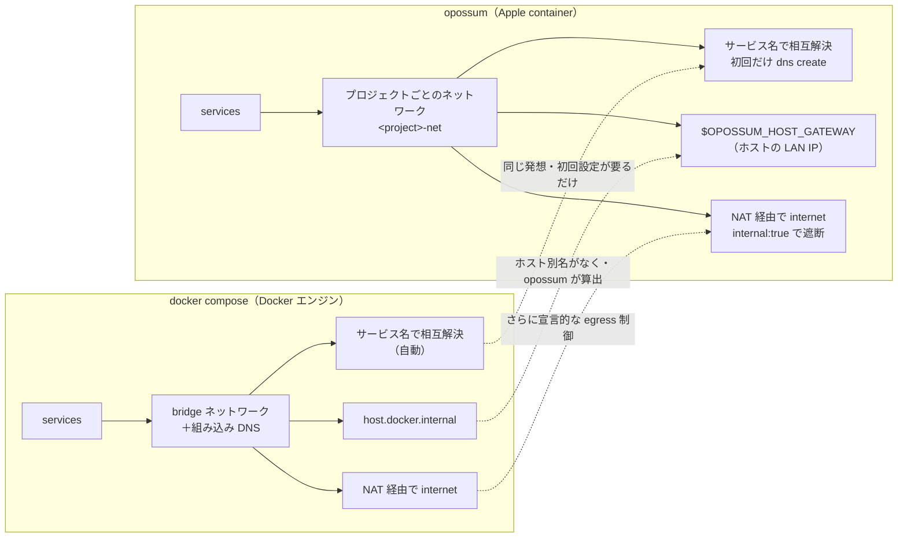

<p align="center">
  
</p>

<p align="right"><a href="README.md">English</a></p>

macOS の [Apple `container`](https://github.com/apple/container) ランタイム向けの、Docker Compose ライクなオーケストレータです。使い慣れた `compose.yaml` にマルチサービス構成を書けば、`opossum` が依存関係の順にサービスを起動し、共有ネットワーク上でサービス同士が名前で到達できるようにします。

opossum は Docker Compose ファイル（`docker-compose.yml`）と互換で、オープンな [Compose 仕様](https://compose-spec.io) のサブセットを実装しています。

> **これは英語版 [README.md](README.md) の日本語訳です。** 内容の正本は英語版で、細部で差が出た場合は英語版が優先されます。

> **AI エージェントから opossum を使う場合は** [`AGENTS.md`](AGENTS.md) を読ませてください。コマンド一覧、対応・無視・拒否される compose フィールド、失敗シグネチャと対処の対応表を、エージェントのコンテキストに読み込ませる前提で事実だけを高密度にまとめてあります。人間が読む分には、以下のクイックスタートで大丈夫です。

> **なぜ今これが可能になったのか：** コンテナ間のネットワークと名前解決は **macOS 26** の機能に依存しています。macOS 15 まではコンテナ同士がネットワーク的に隔離されていて、この種のオーケストレーションは成立しませんでした。`container` は 2026 年 6 月に 1.0 に到達しています。

## 特徴

- **依存関係順の起動**：`depends_on` をトポロジカルソートした順で起動し、停止は逆順。
- **ヘルス連動・ワンショット依存**：`service_healthy` はヘルスチェックの通過を、`service_completed_successfully` はワンショット処理の正常終了（exit 0）を待ってから、依存元を起動。
- **サービス名だけで相互到達**：プロジェクトごとのネットワーク上で、サービス同士が `db` のような素の名前で解決し合える。
- **複数プロジェクトの同時実行**：コンテナはプロジェクト単位で名前空間が分かれるので、同じサービス名を持つスタックを追加設定なしで並行実行できる。
- **コマンド**：`up [service…]`（全体または一部）、`down`、`ps`（IP・ポート・状態）、`logs [-f] [-n]`、`stop`、`restart`。
- **Compose サブセット**：`image`、`build`、`ports`、`environment`、`volumes`、`command`、`entrypoint`、`healthcheck`、および `.env` / `${VAR}` 補間。
- **失敗時は後始末**：`up` が途中で失敗したら、起動済みのコンテナと作成済みのネットワークを巻き戻す。

変更履歴は [`CHANGELOG`](CHANGELOG.md)、各サブコマンドの実例は [`examples/`](examples/README.md) にあります。

## なぜ opossum か（vs docker compose）

opossum は、使い慣れた `docker compose` 風のワークフローを、Docker Desktop ではなく Apple の `container` の上で提供します。Docker の「常時起動の大きな Linux VM がひとつ」という構成が「コンテナごとに軽量 VM」に変わるので、トレードオフも変わります。1台の Mac での実測値です（macOS 26 / Apple silicon、container 1.0.0 と Docker Engine 29.5.3 の比較。[計測方法と注意点](docs/benchmarks.md)）：

| | Docker Desktop | Apple `container`（opossum） |
|---|---|---|
| アイドル時メモリ | ホストプロセス ~373 MB **＋常時起動の Linux VM ~7.8 GB**（`docker info` の MemTotal） | ヘルパー **~58 MB** のみで **常時起動 VM なし**（メモリを使うのはコンテナ実行中だけ。各コンテナは ~250〜400 MB の独立 VM） |
| 単一コンテナの起動 | **~0.19 秒** | ~0.81 秒 |
| 隔離 | VM をコンテナ間で共有 | **コンテナごとに VM** |
| ライセンス | 大規模組織は有償サブスクリプション | オープンソースで不要 |

**まとめると：** 個別コンテナの起動は Docker のほうが速い（VM が常に温まっているため）一方、Apple `container` はアイドル時がはるかに軽く（数 GB の VM が遊んでいない）、Docker Desktop なしでコンテナごとの VM 隔離が得られます。opossum はその上に compose の使い勝手（依存順の起動・名前でのサービスディスカバリ・ヘルス連動・プロジェクト隔離）を載せるものです。「重い常時起動 VM なしで compose の快適さが欲しい」場合に向いていて、短命コンテナを大量に、起動レイテンシ律速で回すなら Docker が今も有利です。なお、bind mount のファイル I/O だけは opossum でも **解決しません**。これは Docker と同じ host↔VM 共有ファイルシステムの問題で（小さいファイルを大量に扱う処理はどちらも遅い）、DB データや `node_modules` のようなホットパスは **named volume** に置いてください。詳細は [`docs/benchmarks.md`](docs/benchmarks.md)、アイドルフットプリント・使い捨てコンテナの速度・ビルド・ディスク・日常運用まで含めた比較は [`docs/vs-docker-desktop.md`](docs/vs-docker-desktop.md) にあります。

**ネットワークは自前実装ではなく、ランタイムの機能に乗っています。** opossum は独自の DNS を立てず、Apple `container` の組み込み DNS（macOS 26）を使います。各コンテナに `<service>.<project>.<domain>` という名前を付け、対応する検索ドメインを設定する。これはランタイムが期待するとおりの形なので、サービス同士は **素のサービス名** で解決し合え、プロジェクト間は隔離され、オーバーレイネットワークも opossum 独自の `/etc/hosts` 書き換えも必要ありません。opossum は `container` 1.0 の薄い層として、ネットワークを迂回するのではなく継承します。名前解決を担うのはランタイムの組み込み DNS で、opossum はその命名規約に従っているだけです。

## 設計

opossum は薄いオーケストレーション層で、ランタイムを再実装しません：

- **パース**：compose スキーマのサブセットを読む（`image`、`build`、`ports`、`environment`、`volumes`、`depends_on`、`command`、`entrypoint`）。
- **順序付け**：`depends_on` でサービスをトポロジカルソートして起動し（循環は拒否）、停止は逆順。
- **サービスディスカバリ**：プロジェクトごとのネットワーク（`<project>-net`）を作り、全サービスを接続する。ランタイムはコンテナ名が **`<name>.<domain>` 形式のとき** に DNS 登録するので、opossum は各コンテナを `<service>.<domain>`（例：`db.opossum`）と名付けて `--dns-domain <domain>`（既定 `opossum`）で起動する。各コンテナの検索リストに `<domain>` が入るため、サービスは `db` や `cache` のような **素のサービス名** で相互到達でき、compose のセマンティクスと一致する。ドメインは最初に一度だけ作成が必要（セットアップ参照）。この仕組みは macOS 26 以降の `container` 組み込み DNS に依存する。
- **ランタイム**：実行はすべて `container` CLI に委譲する（`build`、`run`、`stop`、`delete`、`network`、`inspect`）。

```
compose.yaml ─▶ compose.Load ─▶ StartupOrder ─▶ orchestrator ─▶ container CLI
```

## 必要環境

- Apple silicon の macOS 26 以降
- [`container`](https://github.com/apple/container) がインストール済みで起動済み（`container system start`）、かつ `PATH` 上にあること
- Go 1.25 以降（ソースからビルドする場合）

## インストール

### Homebrew

```sh
brew install suruseas/opossum/opossum
```

ビルド済みバイナリが入るので、Go ツールチェインもローカルビルドも不要です。依存として Apple の `container` ランタイムも一緒に入ります。タグ付きリリースごとに更新され、ランタイムが Apple silicon の macOS 26 を要求する関係で `darwin/arm64` のみの提供です。

### ソースから

```sh
make build   # バージョンを埋め込んで ./opossum をビルド
# make を使わない場合（素の go build だとバージョンが dev になります）：
go build -ldflags "-X main.version=$(git describe --tags --always | sed 's/^v//')" -o opossum ./cmd/opossum
# ビルドしたら PATH の通った場所へ。例：
mv opossum /usr/local/bin/
```

## セットアップ（初回のみ）

サービスディスカバリには、システムに登録したローカル DNS ドメインが必要です。一度作成すれば、再起動後もそのまま残ります：

```sh
sudo container system dns create opossum
```

別の名前を使いたい場合は、その名前で作成して `--dns-domain <name>` を指定します。不要になったら `sudo container system dns delete opossum` で削除できます。

## クイックスタート（`docker compose` から来た人向け）

opossum は既存の `compose.yaml` / `docker-compose.yml` を **そのまま** 読みます。変換も専用ファイルも要りません。Docker Desktop からの乗り換えなら、イメージはすでにビルド済みのはずなので、それを再利用して Apple のビルダー（コールドスタートで遅い）を回避するのが最速です：

```sh
# 初回のみ：Apple container を起動し、サービスが名前解決できるよう
# ローカル DNS ドメインを登録
container system start
sudo container system dns create opossum

cd path/to/your-project
docker compose build       # まだビルドしていなければ（イメージがあれば不要）
opossum up --from-docker-compose   # ビルド済みイメージを Docker から取り込んで起動
```

ビルド済みイメージの名前は `docker compose` も opossum も同じ `<project>-<service>` 形式で、プロジェクト名の既定はどちらもディレクトリ名です。そのため取り込んだイメージがそのまま `up` で使われます。ただしディレクトリ名に `_` や `.` が含まれると2つのツールで正規化が食い違うので、その場合は両方のコマンドに **同じ** `-p <name>` を渡してください。

これだけで、同じプロジェクトが Apple `container` の上で動きます。操作コマンドも見慣れたものです：

```sh
opossum ps            # サービス / IP / ポート / 状態
opossum stats         # サービスごとのライブ CPU / メモリ / net / I/O
opossum logs web -f   # サービスのログを追う
opossum exec -it web sh
opossum down          # 停止＋削除（-v で named volume も削除）
```

**Apple のビルダーでビルドしたい場合は**、`--from-docker-compose` を外して `opossum up` を実行すれば、opossum が `build:` を持つサービスを自前でビルドします（重いビルドには時間がかかることがあります。[ビルドのトラブルシュート](#ビルドのトラブルシュート)参照）。どちらの場合も、先に `opossum config` を実行すると、補間を解決した後の設定と、opossum が無視するフィールド（`restart`、`dns_search` など）を確認できます。

**サービスが起動しないときは**、まず次の4つを疑ってください。どれも `up` 実行時に警告として表示されます（[docker compose との違い](#docker-compose-との違い)も参照）：

1. **DNS ドメインが未登録**：サービスが名前解決できません。上記セットアップのコマンドを実行してください。
2. **Postgres のデータが named volume 直下**：`initdb` が失敗します。`PGDATA` をサブディレクトリに向けてください（`environment: PGDATA=/var/lib/postgresql/data/pgdata`）。MySQL/MariaDB は問題ありません。
3. **ホストポートが使用中**：`up` がポート番号とサービス名を表示します。macOS で 5000 番や 7000 番が埋まっている場合、原因はたいてい **AirPlay レシーバー** です（システム設定 › 一般 › AirDrop と Handoff でオフにするか、ホストポートを変更）。
4. **一時ディレクトリからのビルド**：Apple のビルダーは `/private/tmp` 配下やシンボリックリンク経由のコンテキストを読めません。ホームディレクトリ配下の実パスからビルドするか、`--from-docker-compose` を使ってください。

### Docker で既にビルドしたイメージを再利用する

イメージは OCI 標準なので、Docker でビルドしたイメージは Apple `container` でも動きます（両者はイメージストアが別なだけです）。`docker compose` から来たならサービスはビルド済みのはずで、`opossum import` がそれをコピーしてくれるので、最初の `up` を Apple のビルダーでのリビルドなしに完了できます：

```sh
docker compose build          # （または既にイメージがある）
opossum import                # build サービスごとに docker save → container image load
opossum up                    # リビルドなしですぐ起動

# 1ステップでやるなら、build サービスをビルドせず取り込んで起動：
opossum up --from-docker-compose
```

`docker compose` と opossum はビルド済みイメージを同じ形式（`<project>-<service>:latest`）で名付けるので、取り込んだイメージは `up` が探すタグにそのまま一致します。この経路は、Apple のビルダーが扱えない Dockerfile（BuildKit 固有機能を使うもの）の逃げ道にもなります。Docker でビルドして取り込めばよいからです。`docker` コマンドを呼ぶのは `import` だけで、通常の実行経路が `docker` に触れることはありません。レジストリに push して `opossum pull` で取得する方法も使えます。

### Docker と併用しても安全

opossum が駆動する Apple の `container` ランタイムは、Docker とは **完全に別物** です（イメージ・コンテナ・ボリュームのストアがすべて別）。そのため、`docker compose` で使っているプロジェクトに対して `opossum up` を実行しても、Docker 側の環境を乱すことはありません：

- **Docker のコンテナや named volume には触れません。** opossum が呼ぶのは `container` CLI だけで、`docker` は呼びません。named volume は `container` 側に独自に作られ、`opossum down -v` が消すのもそちらだけです。同名の Docker ボリュームとそのデータは残ります。
- **共有されるのは bind mount だけです。** `./path:/…` のような bind mount は、どちらのエンジンも同じホストディレクトリを指します。opossum と Docker を同じ bind mount のデータ（例：DB のデータディレクトリ）に **同時に** 向けて走らせないでください。これは「2つのエンジンでひとつのデータディレクトリ」を触るときの一般的な危険で、opossum 固有の問題ではありません。
- **ポートとデータ。** Docker のスタックが同じホストポートで先に動いていれば、opossum の `up` は単にバインドに失敗するだけです（実害なし）。named volume のデータはランタイム間で共有されないので、該当サービスは Docker 側のデータではなく、新しい空のボリュームで起動します。

要するに、**既存の `docker-compose.yml` に opossum を向けて `opossum up` を試して大丈夫** です。最悪でもポート衝突か、非対応フィールドが無視される（`opossum config` か `--verbose` で確認できます）程度で、データが失われることはありません。

## 使い方

```sh
opossum up                 # ビルド＋全サービス起動（デタッチ）
opossum up web             # web とその依存だけ起動
opossum up web --foreground  # 単一サービスをフォアグラウンドでアタッチ実行
opossum ps                 # サービス / コンテナ / IP / ポート / 状態
opossum logs               # 全サービスのログ
opossum logs web --follow  # 1サービスのログを追う（-n N で tail 行数）
opossum stats              # サービスごとのライブ CPU/メモリ/net/IO（--no-stream で1回だけ）
opossum exec web ls -la    # 実行中サービスでコマンド実行
opossum exec -it web sh    # サービスで対話シェル
opossum run --rm web sh    # サービス定義から使い捨てのワンオフコンテナ
opossum stop [service...]  # 削除せずに停止
opossum restart [service…] # その場で停止して再起動
opossum down               # サービスとネットワークを停止＋削除

opossum -f path/to/compose.yaml up      # compose ファイルを指定
opossum -p myproj up                     # プロジェクト名を上書き
```

`-f` を省くと、opossum は作業ディレクトリの compose ファイルを docker-compose と同じ優先順（`compose.yaml`、`compose.yml`、`docker-compose.yaml`、`docker-compose.yml`）で探します。手元の `docker-compose.yml` はそのまま動きます。

同梱の例（ビルド不要の `hello.yaml` とフル機能の `compose.yaml`）で試せます。各サブコマンドの実例は [`examples/README.md`](examples/README.md) にあります：

```sh
cd examples
opossum -f hello.yaml up
opossum -f hello.yaml ps
```

例の `web` サービスは起動時に `db` と `cache` の解決済み IP を表示するので、名前ベースのサービスディスカバリが動いていることを確認できます。

## Compose サポート

| フィールド | 対応 | 備考 |
|-------|-----------|-------|
| `image` | ✅ | |
| `build` | ✅ | 文字列コンテキスト、または `{context, dockerfile, args, target}`（マルチステージの `target` 対応） |
| `platform` | ✅ | `container run --platform` に渡す。`linux/amd64` では `--rosetta` も有効化し、x86-64 専用イメージを Apple silicon で実行 |
| `ports` | ✅ | `container run -p` に渡す。短形式（`"8080:80"`、`"3000"`）と長形式（`{target, published, protocol, host_ip}`）の両対応。コンテナポートのみの指定にはホストポートを補う（Apple のランタイムでは必須のため） |
| `environment` | ✅ | list 形式・map 形式。null 値はホスト環境の値をそのまま渡す |
| `env_file` | ✅ | 文字列または list（短形式・長形式 `{path, required}`）。`KEY=VALUE` を統合し、`environment` が上書き。ファイルがない場合は `required: false` でない限りエラー |
| `volumes` | ✅ | bind mount（ホストパスは compose ファイルのディレクトリ基準で解決、`~` 展開、ソースがなければ作成）、named volume（`<project>_<volume>` に名前空間化）、`type: tmpfs`（`--tmpfs`）。短形式 `src:dst[:ro]` と長形式の両対応 |
| `tmpfs` | ✅ | サービスレベルの tmpfs ターゲット（文字列または list）。`type: tmpfs` ボリュームと統合される |
| `secrets` | ✅ | ファイルベースのみ。`/run/secrets/<name>` に read-only でマウント（`*_FILE` パターン向け）。`external` secret は拒否、`uid`/`gid`/`mode` は効果なし |
| `depends_on` | ✅ | list または長形式（`condition`）。起動順序と、`service_healthy` / `service_completed_successfully` の待ち合わせ |
| `healthcheck` | ✅ | `test`（CMD / CMD-SHELL / 文字列）、`interval`、`timeout`、`retries`、`start_period` |
| `command` | ✅ | list、またはシェル風に単語分割される文字列（`sh -c "echo hi"` → `sh`, `-c`, `echo hi`） |
| `entrypoint` | ✅ | イメージの ENTRYPOINT を上書き。文字列（分割される）または list で、`command` と同じ扱い |
| `profiles` | ✅ | profiles 付きサービスは、そのプロファイルが有効なときだけ起動（`--profile <name>`、`COMPOSE_PROFILES`、またはサービス名の直接指定）。`profiles` なしのサービスは常に起動 |
| `mem_limit` / `cpus` | ✅ | `container run` の `-m` / `-c` に渡す。`deploy.resources.limits.{memory,cpus}` も読む（両方書く場合は一致が必要）。メモリは MiB に、CPU は整数に切り上げ（Apple のランタイムは vCPU を整数で割り当てるため） |
| `ssh` | ✅ | `ssh: true` でホストの SSH エージェントをコンテナに転送（`container run --ssh`）。鍵をイメージに焼き込まずに、ホストの鍵で private リポジトリを `git clone`/`push` できる。ワンオフ実行でも `opossum run --ssh` が使える。（opossum 拡張。docker compose にあるのはビルド時の `build.ssh` のみ） |
| `develop.watch` | ✅ | `opossum watch` で使用。`path` 配下のホストファイル変更に対し、`action: sync` は変更ファイルを実行中コンテナの `target` へコピー、`rebuild` はイメージ再ビルド＋コンテナ再作成、`sync+restart` はコピー後に再起動。再ビルド・再起動はバッチ化され、`ignore` の glob も尊重。`path` には **ディレクトリ** を推奨（単一ファイル指定はエディタのアトミック保存を取りこぼすことがある） |
| `user` / `working_dir` | ✅ | `container run` の `--user`（`name\|uid[:gid]`）と `--workdir` に渡す |
| `init` | ✅ | `init: true` → `--init`。ゾンビプロセスを回収する tini 風の init を PID 1 に置く |
| `read_only` | ✅ | `read_only: true` → `--read-only`。root ファイルシステムを読み取り専用に |
| `cap_add` / `cap_drop` | ✅ | Linux ケーパビリティを `--cap-add` / `--cap-drop` に渡す（例：`NET_ADMIN`、`ALL`） |
| `network_mode` | ✅（`none`） | `network_mode: none` → `--network none`。完全なネットワーク隔離（loopback のみ、外向き通信も名前解決もなし）で、信用できないワークロードを閉じ込める最も強い設定。それ以外の値（`host` など）は Apple `container` に相当機能がないため無視され（サービスはプロジェクトのネットワークに参加）、無視フィールドとして一覧に載る。ファイル自体は読み込める |
| `networks`（top-level ＋サービスごと） | ✅ | ネットワークを宣言してサービスを配置（複数参加可。それぞれ `--network` として宣言順に渡す）。top-level の `internal: true` は host-only で作成（`container network create --internal`）：internet への egress なし、ホストへは到達可。[egress を絞る](#egress-を絞るエージェントサンドボックス)参照。`external: true`（`name` 指定可）は既存ネットワークをその名前のまま使う（作成も削除もしない）。internal ネットワークでは名前解決が効かないので IP を使う。**alias** は効果なし |
| `${VAR}` 補間 | ✅ | `$VAR`、`${VAR}`、`${VAR:-default}`、`${VAR:?required}`、`$$` エスケープ。値は compose ファイルと同じ場所の `.env`（または `--env-file` 指定・後勝ち）から取り、シェル環境変数が上書き |

その他の compose フィールド（`container_name`、`restart` など）はパースはされますが、効果を持ちません。無視されたフィールドは `opossum config`（または `opossum up --verbose`）が列挙するので、手元の `docker-compose.yml` が黙って違う動きをすることはありません。

**複数ファイルのマージ** は docker compose と同じです：`-f base.yml -f override.yml` で後のファイルが優先され、マップはキー単位でマージ、多くのシーケンスは追記、`command`/`entrypoint` は置換されます。`volumes` はマウント先（コンテナ側のパス）単位でまとめられ、同じパスへのマウントが複数あれば最後のものが残ります（後のファイルが bind mount を named volume に差し替えられます）。見つけた compose ファイルと同じ場所に `compose.override.yaml`（または `docker-compose.override.yml`）があれば自動でマージします。

**opossum オーバーレイ。** 見つけた compose ファイルと同じ場所に `compose.opossum.yaml`（または `.yml`）があれば、**最後に・最優先で** マージします（ベースファイルと `compose.override.yaml` の後）。docker compose はこの名前を読まないので、同じディレクトリを両ツールで共有でき、元のファイルは無傷のまま——Apple `container` 上で動かすための調整をここに置き、共有の compose ファイルからは切り離せます。マージした際は、対象ファイル名を添えた 1 行の通知を出します（不要ならファイルを削除すれば無効化できます）。

`opossum up --from-docker-compose` は、**このオーバーレイを自動生成します**。`docker-compose.yml` には、あなたのファイルの誤りではなく**ランタイムの性質**が原因でこの環境では起動できないパターンが 2 つあります：

| 内容 | Apple `container` で失敗する理由 | オーバーレイがすること |
|---|---|---|
| Postgres のデータディレクトリに named volume を直接マウント | ボリュームがマウントポイントになるためディレクトリが空でなく、`initdb` が拒否する（`OPSM-101`） | `PGDATA` をサブディレクトリに向ける。データは同じボリューム内に留まる |
| DB のデータディレクトリが bind mount | bind mount はホスト所有でコンテナ内から chown できないが、公式 DB イメージは起動時に必ず chown する（`OPSM-105`） | そこに named volume をマウントする。**データの置き場所が変わる**（ホスト側のディレクトリはコピーされず、そのまま残る） |

生成される各エントリには、何を変えたか・なぜか（診断コード付き）・効いたことをどう確認するか・それでも失敗したら何をするか・どう元に戻すか が書かれます。**既存の `compose.opossum.yaml` は決して上書きしません**。あなたの compose ファイルも変更せず、直すものが見つかったときだけ生成します。プロジェクトの**意味**を変えてしまうもの（共有のセマンティクス・公開ポート・アプリ固有の初期データ投入）は、自動修正せず警告のままにして判断を委ねます。

## コマンドサポート

opossum は一般的な `docker compose` サブコマンドを揃え、それぞれを `container` CLI に委譲します。

| コマンド | 対応 | 備考 |
|---------|-----------|-------|
| `up [service…]` | ✅ | ビルドして起動（全体、または指定サービスとその依存）。設定が変わっていない実行中サービスには触れず（イメージがないときだけビルド）、compose から消えたサービスの孤児コンテナを検出。`--force-recreate`、`--build`、`--no-build`、`--from-docker-compose`（旧名 `--from-docker` も引き続き動作し、警告を出します）、`--remove-orphans`、`--foreground`、`--profile` |
| `down [-v] [--rmi local\|all]` | ✅ | 停止・削除し、プロジェクトのネットワークも削除。`-v` は named volume も削除。`--rmi local` は opossum がビルドしたイメージを削除（`all` は pull したものも）。`--remove-orphans` は消えたサービスのコンテナも削除 |
| `ps` | ✅ | サービス / コンテナ / IP / ポート / 状態 |
| `images` | ✅ | 各サービスのイメージ名、opossum がビルドするか、ローカルにあるか |
| `logs [service…]` | ✅ | `--follow`（複数サービスを多重化し、行頭にサービス名）、`-n/--tail` |
| `stats [service…]` | ✅ | ライブの CPU / メモリ / net / block I/O / pids（ストリーム表示、`--no-stream` で1回だけ）。`--host` はサービスごとの **ホスト側** メモリフットプリント（Mac 上の VM の resident サイズ）。共有 VM 型ツールにはサービス別に出せない値（後述） |
| `exec [-it] <service> <cmd…>` | ✅ | 実行中サービスでコマンド実行 |
| `build [service…]` | ✅ | `build:` を持つサービスのイメージをビルド |
| `pull [service…]` | ✅ | `image:` を持つサービスのイメージを pull |
| `import [service…]` | ✅（拡張） | サービスの Docker ビルド済みイメージを `container` のストアへコピーし、`up` でのリビルドを省く |
| `doctor` | ✅（拡張） | 環境診断（ランタイム・DNS ドメイン・外向き通信・ビルド VM のメモリ・回収可能ストレージ・スタックのメモリ見積り）。✅/⚠️/❌ と一行の対処を表示。`--format json` は機械可読な `{healthy, checks[]}` を返し、失敗チェックがあれば非ゼロ終了 |
| `cp <src> <dst>` | ✅ | サービスのコンテナとホストの間でファイルコピー（各パスはホストパスか `service:path`）。`docker compose cp` と同様 |
| `watch` | ✅ | 各サービスの `develop.watch` のパスを監視して変更に反応（`docker compose watch` 相当）：`sync` はコピー、`rebuild` は再ビルド＋再作成、`sync+restart` はコピー＋再起動。Ctrl-C まで動き続ける。先に `up` しておくこと |
| `start [service…]` | ✅ | 既存の停止中コンテナを起動 |
| `stop [service…]` | ✅ | 削除せずに停止 |
| `restart [service…]` | ✅ | その場で停止して再起動 |
| `kill [service…]` | ✅ | シグナル送信（既定 KILL）。`-s/--signal` |
| `run [--rm] [--no-deps] [-T] <service> [cmd]` | ✅ | ワンオフのフォアグラウンドコンテナ。`--no-deps` を付けなければ依存も起動。`-T`/`--no-tty` で疑似端末を無効化。進捗表示は stderr に出るのでワンオフの stdout は汚れない（MCP の stdio ブリッジに使える）。ポートは公開しない |
| `config [--services]` | ✅ | 解決後の設定を検証して表示（補間と env_file 適用後）。無視されるフィールドも注記。`up` が起動する内容と一致（`profiles:` 付きサービスは `--profile` 指定時のみ表示） |

どのコマンドにも `--verbose` を付けると、実行される `container` コマンド（`+ container …`）が stderr に表示されます。opossum が実際に何を実行したか見えるので、バグ報告のときにも便利です。

### このサービス、Mac のメモリをいくら使ってる？（`stats --host`）

素の `opossum stats` が表示するのは **ゲスト** 視点、つまり各コンテナが VM 内の RAM 上限をどれだけ使っているかです。しかし Mac で実際に知りたいのはたいてい **ホスト** 視点、つまりこのサービスがマシンのメモリをどれだけ取っているかでしょう。Apple `container` は各コンテナに独立した VM を与えるので、これはサービスごとに切り分けられる実在の数字で、`opossum stats --host` が報告します：

```
SERVICE  GUEST MEM      HOST FOOTPRINT
web      1.9MiB / 1GiB  330.4MiB
db       1.9MiB / 1GiB  330.7MiB
         total          661.2MiB
```

共有 VM 型のツール（Docker Desktop、Colima、OrbStack）では、全コンテナがひとつの VM に同居するため、構造上この数字をサービス別に分解できません。値はサービスの VM プロセスの resident サイズ（アクティビティモニタで「Virtual Machine Service…」として見える値）をホスト側から読んだもので、あくまで概算です。VM を特定できないサービスは失敗にせず `—` を表示します。（`opossum doctor` はもっと粗い、実行中コンテナを見ない見積りを出します。）

## docker compose との違い

opossum は手元の `compose.yaml` をそのまま動かすことを目指していますが、委譲先が Docker エンジンではなく Apple の `container` なので、一部の挙動が異なり、一部の compose 機能には対応しません。ここでは一覧だけを示します。それぞれの詳しい理由は [既知の制限](#既知の制限) にあります。

**挙動が異なるもの**（同じフィールドだが仕組みが違う）：

| 領域 | docker compose | opossum（Apple `container` 上） |
|------|----------------|--------------------------------|
| セットアップ | 不要 | 名前解決のため、初回だけ `sudo container system dns create opossum` |
| コンテナ名 | `<project>-<service>-N` | `<service>.<project>.<domain>`（この名前で DNS 登録され、素の名前で解決できる） |
| named volume | 名前でグローバルに共有 | `<project>_<volume>` に名前空間化。`down -v` が消すのは自プロジェクトの分だけ |
| ボリュームの初期データ | 新規の named/匿名ボリュームには、そのパスのイメージ内容がコピーされる | **コピーされない**。新規ボリュームは named も匿名も常に空でマウントされる |
| ネットワーク | ユーザ定義ネットワーク＋alias | `networks:` に **対応**。プロジェクトごとの既定ネットワーク（`<project>-net`）に加え、top-level の `internal:`/`external:` とサービスごとの複数参加が使える。alias と静的 IP は効果なし（[ネットワークモデル](#ネットワークモデル)参照） |
| 公開ポート | `ports: - "3000"` はランダムなホストポート | `3000:3000` として扱う。Apple `container` はホストポートの明示が必須で、ランダム割り当てがない |
| ヘルスチェック | エンジンが実行 | ランタイムにヘルスチェック機能がないため、opossum が `healthcheck.test` を `container exec` で実行してポーリング |
| `service_completed_successfully` | エンジンが終了を追跡 | opossum がワンショットを **フォアグラウンド** で実行（終了コードはそこでしか観測できないため） |

**非対応、または回避のない制約：**

- **プラットフォーム**：Apple silicon の macOS 26 以降、単一ホストのみ（Swarm やリモートはなし）。`container` の macOS 26 のネットワークと DNS に依存します。
- **無視されるフィールド**（パースはされ、`opossum config` / `--verbose` が列挙しますが、効果を持ちません）：`restart`、`container_name`、`dns`/`dns_search`（サービスディスカバリは自動です。[ネットワークモデル](#ネットワークモデル)参照）、`none` 以外の `network_mode`、ネットワークごとの **alias** と静的 IP（`ipam`）、`deploy`（`resources.limits` を除く）、`sysctls`、`devices`、`privileged`、top-level ボリュームの `driver`/`labels`。（`networks` と `cap_add`/`cap_drop` は効きます。）
- **`secrets`**：ファイルベースのみ。`external` secret と `uid`/`gid`/`mode` には対応しません。
- **DB のデータディレクトリを named volume 直下に置けない**：Postgres の `initdb` は named volume のマウントポイントでは失敗します。**サブディレクトリ** を使ってください（`PGDATA=/var/lib/postgresql/data/pgdata`）。gitea や nextcloud など実際のアプリの compose で頻出のパターンなので、PGDATA のサブディレクトリ指定なしに `/var/lib/postgresql/data` へ named volume が張られていると `up` が **警告** します。（MySQL/MariaDB はマウントポイント直下でも動きます。）
- **DB のデータディレクトリに bind mount は使えない**（**named volume** を使う）：Apple `container` の bind mount はホスト所有（virtiofs）で、コンテナ内から `chown` できません。データディレクトリを chown しようとする DB イメージ（MySQL、Postgres など）は `chown: … Operation not permitted` で起動に失敗します。named volume なら chown できるので、そちらからマウントしてください。Linux ホストの慣習で `/mnt/docker-volumes/<svc>/…` を bind mount する self-host 系の compose は、macOS ではここを踏みます。この形で DB がクラッシュすると `up` が対処を表示します。
- **ボリュームにイメージの内容がコピーされない**：Docker は新規の named/匿名ボリュームの初回マウント時に、そのパスにあるイメージ内のファイルをコピーしますが、Apple `container` は常に **空** でマウントします。これで壊れるのが「ソースを bind mount しつつ `- /app/node_modules` をボリュームにして、イメージ内の依存を残す」という開発の定番パターンです。opossum ではその `node_modules` が空になり、`ng serve` や `vite` などがパッケージを見つけられず起動しません。コンテナ起動時に依存をインストールする（`command: sh -c "npm ci && npm start"`）か、依存ディレクトリをボリュームで覆わないことで回避してください。**named volume でも同じ** です（匿名ボリュームだけの話ではありません）。
- **ビルドコンテキスト**：Apple のビルダーは `/private/tmp` 配下やシンボリックリンク経由のコンテキストを読めません。ホームディレクトリ配下の実パスからビルドしてください（`up` が警告します）。
- **そもそも動かないもの**：Linux ホストのカーネルアクセスを前提とする compose（WireGuard の `NET_ADMIN` ＋ `/lib/modules` など）は、Apple `container` がその機能を提供しないため動きません（ホストパス前提の部分は Docker Desktop でも同様です）。`/var/run/docker.sock` 経由で Docker を操作するツール（Portainer など）も opossum のコンテナは管理できません。ホストの Unix ソケットを bind mount すること自体は `container` 1.1.0 以降で可能ですが、Apple `container` は Docker 互換のデーモンソケットを公開しない（ホストとは XPC で通信する）ので、マウントした先に応答する相手がいないのです。
- **cgroup を読む JVM イメージ（Elasticsearch 7.x など）**：コンテナ同梱の JDK がヒープサイズ決定のためにホストの cgroup を読みますが、Apple `container` の VM は期待される形の cgroup マウントを公開しないため、設定が適用される前に `CgroupInfo.getMountPoint() … null` でクラッシュします（`ES_JAVA_OPTS`/`JAVA_TOOL_OPTIONS` では回避できず、ES 7.16/7.17 で確認）。`opossum ps` では `stopped` と表示されるので、`opossum logs <svc>` を確認してください。これはランタイムと JDK の非互換で、opossum 側の制限ではありません。
- **パースしないもの**：`configs`、`extends`、`external` のマップ形式。

[Compose サポート](#compose-サポート) と [コマンドサポート](#コマンドサポート) の表にあるものは、上記を除きすべて docker compose と同じように動きます。

## ネットワークモデル

opossum が docker compose から最も離れているのがネットワークです。Apple `container` のネットワークモデルが Docker エンジンと根本的に違うためで、opossum は Docker の挙動を再実装するのではなく、compose の記述を Apple `container` のモデルに対応付けます。このセクションはその対応表です。

まず全体像です。2つのモデルはどこが同じで、どこを opossum が橋渡ししているのか：



下の表は同じ内容の詳細版です。各行が「docker compose でやりたいこと」に対して「opossum では何を書くか」を示します：

| 論点 | docker compose（Docker エンジン） | opossum（Apple `container`）では何を書くか |
|---------|--------------------------------|----------------------------------------------|
| 既定の疎通 | bridge ネットワーク、NAT で外向き | プロジェクトごとのネットワーク、NAT で外向き。何も書かなくてよい |
| **ホスト** に到達する | `host.docker.internal` / `--add-host` | **`host.docker.internal` はない**。組み込みの **`${OPOSSUM_HOST_GATEWAY}`**（ホストの LAN IP。ホスト側サービスは `0.0.0.0` にバインドが必要）を使う。[ホストのサービスに到達](#ホストのサービスに到達)参照 |
| サービス **ディスカバリ** | ネットワーク上の組み込み DNS が自動で解決 | 組み込み DNS はあるが **ドメイン登録が必要**。初回だけ `sudo container system dns create opossum` を実行すれば、以後サービスは素の名前（`db`、`web`）で解決し合える |
| コンテナ名と **プロジェクト隔離** | `<project>-<service>-N`、名前でスコープ | プロジェクトごとのネットワーク（`<project>-net`）上の `<service>.<project>.<domain>`。プロジェクトは自動で隔離される。[複数プロジェクト](#複数プロジェクトの同時実行)参照 |
| **internet egress** を制限する | ネイティブの制御なし（外部のファイアウォールが必要） | ネットワークの `internal: true` が **internet への経路を取り除く**（ホストへは到達可）。`network_mode: none` は loopback のみ。[egress を絞る](#egress-を絞るエージェントサンドボックス)参照 |
| 複数ネットワークと **external** | alias 付きで対応 | サービスごとの複数参加（それぞれ `--network`）と `external: true`（既存ネットワークを名前で再利用）のどちらも動く |
| **`internal:` ネットワーク** での名前解決 | 動く | **動かない**。DNS リゾルバは internal ネットワークから到達できないゲートウェイ上にいるため、相手は **IP** で指定する（またはホストのプロキシを `${OPOSSUM_HOST_GATEWAY}` 経由で使う） |
| ネットワークごとの **alias** と静的 IP（`ipam`） | 適用される | **効果なし**（名前の一意性は `<project>` サブドメインが担保する） |

docker compose から来た人が驚きやすいのは、次の3点です：

- **`host.docker.internal` がありません。** Apple `container` の既定ネットワークは NAT 専用で、ホストへの別名を公開しません。代わりに opossum がホストの LAN アドレスを算出し、`${OPOSSUM_HOST_GATEWAY}` として compose の読み込み時に補間します。コンテナから届くようにするため、ホスト側のサービスは loopback だけでなく `0.0.0.0` で待ち受けてください。
- **素の名前での解決には、初回だけ DNS ドメインの登録が必要です。** ランタイムの組み込み DNS は登録済みドメインしか提供しないため、`sudo container system dns create opossum` を一度実行して初めて `db` や `web` が解決できるようになります。省略するとサービス同士が名前で見つけ合えません（`opossum doctor` が指摘し、起動時にも `[OPSM-202]` として警告されます）。
- **`internal:` ネットワークには名前解決がありません。** internet への経路を取り除くこと（エージェントサンドボックスにおける `internal:` の目的そのもの）は、DNS リゾルバへの経路も取り除きます。そのため internal ネットワーク内では相手を IP で指定し、外に出る唯一の正規ルートは `${OPOSSUM_HOST_GATEWAY}` 経由のホストプロキシになります。

`opossum doctor` は、このあたりで最もつまずきやすい2点、つまり DNS ドメインが登録済みか・外向き通信が通るかを確認し、それぞれに一行の対処を表示します。

## 複数プロジェクトの同時実行

プロジェクトは自動で隔離されます。共通の `opossum` ドメインを一度作る以外に、追加の設定は要りません。opossum は各コンテナをプロジェクトで名前空間化します。コンテナ名は `<service>.<project>.<domain>` で、DNS 検索リストに `<project>.<domain>` が入るため、素のサービス名は自分のプロジェクトのコンテナに解決されます（プロジェクト `demo` では `db` → `db.demo.opossum`）。ネットワーク（`<project>-net`）も named volume（`<project>_<volume>`）もプロジェクトごとに分かれます。その結果、同じサービス名を持つ2つのプロジェクトを、完全に隔離したまま並行実行できます：

```sh
opossum -p shopapi up      # db → db.shopapi.opossum
opossum -p blog   up       # こちらの db は db.blog.opossum で衝突しない
```

素の名前での解決は、登録済みの共通ドメインに依存します（セットアップ参照）。`container` にはネットワーク alias がないので、名前の衝突を防いでいるのは `<project>` サブドメインです。DNS ドメインを使わない構成（`--dns-domain ""` でコンテナが素の名前を持つ場合）の安全弁として、各コンテナには `opossum.project=<name>` ラベルが付き、別プロジェクトが所有するコンテナを見つけたときは、黙って置き換えるのではなく **起動を拒否** します。

## MCP サーバーを Apple container で動かす

MCP サーバーは、Apple `container` に向いた形そのものです。小さなイメージがいくつも、ほぼアイドルのまま常駐し、それぞれが独立した VM に隔離される。トークンを預ける第三者コードを VM 単位で閉じ込められる、ということでもあります。MCP サーバーのためだけに Docker Desktop（常駐で数 GB の RAM）を立ち上げているなら、ちょうどよい乗り換え先です。Apple `container` には常駐のベース VM がなく、オンデマンドの stdio サーバーは実行中だけメモリを使い、HTTP サーバーが使うのは `up` している間だけです（実行中のサーバーは ~250〜400 MB の独立 VM で、`down` すれば解放されます）。

**まずは生の `container` コマンドで十分です。** opossum が効くのはもう少し構成が複雑になってからで、秘密情報のない単一の stdio MCP サーバーに opossum は要りません：

```jsonc
// .mcp.json: 単発ならこれで十分
{ "mcpServers": { "terraform": {
    "command": "container",
    "args": ["run", "-i", "--rm", "hashicorp/terraform-mcp-server"] } } }
```

次のどれかに当てはまったら、compose ファイル（[`examples/mcp-stack`](examples/mcp-stack) 参照）へ移行するタイミングです：

1. **秘密情報**：コミットされる `.mcp.json` にトークンを直書きしたくない。
2. **複数サーバー**：`pull`・設定・ライフサイクルを1ファイルでまとめて管理したい。
3. **HTTP トランスポート**：`up`/`down`/`ps`/`logs` で扱う常駐サーバーにしたい。

**トークンを使う stdio サーバー**の場合、トークンは `.env`（git 管理外）に置き、`.mcp.json` は opossum を呼ぶだけにします（トークンは opossum が注入します）：

```jsonc
// .mcp.json
{ "mcpServers": { "github": {
    "command": "opossum",
    "args": ["-f", "/path/to/mcp-stack/compose.yaml", "run", "--rm", "github"] } } }
```

**HTTP（streamable）サーバー**の場合、`opossum up` で起動しておき、クライアントを URL に向けます（公開ポート越しに届くよう、サーバーは `0.0.0.0` にバインドしてください。例：`--transport-host 0.0.0.0`）：

```sh
opossum -f mcp-stack/compose.yaml up          # HTTP サーバーを起動
```
```jsonc
// .mcp.json
{ "mcpServers": { "terraform-http": { "url": "http://localhost:8080/mcp" } } }
```

> **「connected なのにツール呼び出しが失敗する」？** stdio トランスポートはゲスト側ネットワークと無関係に成立するので、コンテナが internet に出られなくてもクライアントには connected と見えます。原因はたいてい、長時間稼働後に default network が詰まる症状です。`opossum doctor`（まさにこれを検査します）を実行し、指摘が出たら `container system stop && container system start` で復旧してください。

## 既知の制限

- **named volume はマウントポイントなので、DB のデータディレクトリを直下に置けません。** opossum は named volume をそのまま扱い、ランタイムが自動作成しますが、`container` はボリュームを `lost+found` 付きのファイルシステムとしてマウントします。Postgres や MySQL の `initdb` は空でないデータディレクトリを拒否するため、`-v pgdata:/var/lib/postgresql/data` は失敗します。マウントの **サブディレクトリ** に DB を向けてください。Postgres なら `environment: { PGDATA: /var/lib/postgresql/data/pgdata }` です。絶対パスに解決されるのは bind mount のホストパスだけです。named volume はプロジェクト単位で名前空間化される（`<project>_<volume>`）ので、並行するプロジェクト間で共有されません。ただし top-level の `volumes:` で `external: true` と宣言したものはその名前のまま使われ、`down -v` でも消えません（ユーザ管理です）。`external` は bool 形式のみで、ボリュームは事前に存在している必要があります（opossum は作りません）。その他の top-level ボリューム設定（`driver`、`labels` など）は効果を持ちません。
- **named volume は2つの実行中コンテナで共有できません。** `container` は named volume を排他的なブロックデバイスとしてアタッチするため、2つのサービスが同じ named volume をマウントすると、先に起動したほうが取得し、残りは `The storage device attachment is invalid` で失敗します（Docker では共有できるため、アプリと nginx が assets 用ボリュームを共有する構成でよく踏みます）。`up` はこの構成を見つけると **警告** します。共有したいデータには **bind mount**（ホストパスなら共有可能）を使うか、イメージに焼き込んでください。
- **`networks:` の alias と静的 IP（`ipam`）は効果を持たず**、`internal:` ネットワークには名前解決がありません（相手は IP で指定）。サービスごとの複数参加と `external:` の再利用はどちらも動きます。全体像は [ネットワークモデル](#ネットワークモデル) を参照してください。
- **`restart:` ポリシーは無視されます。** opossum は終了したコンテナを再起動しません（`up` が警告します）。また `restart` コマンドはコンテナの IP を変えますが、名前と設定は保たれるので、名前ベースのディスカバリには影響しません。
- **Docker-in-Docker、サービス内でのコンテナ実行はできません。** サービスは nested virtualization のない（`/dev/kvm` がない）`container run` の VM で動くため、自前のコンテナを実行できません。`docker` をシェルアウトするビルド・テストジョブはサービス内では動きません。Apple `container` 自体は nested virtualization に対応していますが、それは別系統の `container machine --virtualization` VM 経由のみで、Apple silicon **M3 以降**（macOS 15 以降）が必要です。opossum はまだ container machine を扱わないので、現時点でネストしたコンテナを動かす経路はありません。ここは自然な拡張ポイントで、コントリビューションを歓迎します（エージェント・サンドボックス用途のトラッキング issue を参照）。

### ヘルス連動の起動

`depends_on: {<svc>: {condition: service_healthy}}` と書くと、依存先がヘルシーになるまで依存元の起動を待ちます。Apple の `container` にはネイティブのヘルスチェックがないため、opossum が依存先の `healthcheck.test` を `container exec` で実行してポーリングします（最初に `start_period` 待ち、その後 `interval` 間隔で最大 `retries` 回）。依存先には `healthcheck` の定義が必要で、なければファイルの読み込み自体を拒否します。既定の条件（`service_started`）は起動順序だけを保証します。

`depends_on: {<svc>: {condition: service_completed_successfully}}` は、依存先をワンショット処理（マイグレーションや初期化など）として扱います。opossum はそれを **フォアグラウンド** で実行し、exit 0 で完走したときだけ依存元を起動します。ランタイムが終了コードを公開するのはフォアグラウンドの `run` だけ（`container inspect` はコードなしの `stopped` を返す）なので、完走を期待されるサービスに `service_healthy` を同時に要求することはできません（完走した時点で停止しているためです）。この組み合わせは拒否されます。

### 変数補間

compose ファイル内の変数参照は、パースの前に展開されます。値は compose ファイルと同じ場所の `.env`（`KEY=value` 行、`#` コメント、クォート可）から取られ、プロセスの環境変数が上書きします。つまり `FOO=bar opossum up` は `.env` の `FOO` に勝ちます。対応する形式は `$VAR`、`${VAR}`、`${VAR:-default}`（未設定 **または空** のとき既定値）、`${VAR-default}`（未設定のときだけ既定値）、`${VAR:?message}` / `${VAR?message}`（未設定・空なら失敗）、`$$`（リテラルの `$`）です。既定値のない未定義変数は空文字列に展開されます。参照は YAML のダブルクォート `\` 継続で行をまたげ、既定値の中にネストした参照（`${A:-${B:-x}}`）も解決されます。

展開は YAML パースの **前** に、生のファイルに対して行われます（`x-` 拡張やブロックスカラーを含む全フィールドに一様に効くのはこのためです）。その副作用として、**コメント** 内に書いた `${…}` も展開されます（パース後に補間する docker compose とはここが違います）。`${VAR}` なら実害はありません（コメントはどのみち捨てられます）が、コメント内の `${VAR:?required}` は **読み込みを失敗させます**。補間構文はコメントに書かないか、`$` を `$$` にエスケープしてください。

opossum の組み込み変数はひとつだけです：**`${OPOSSUM_HOST_GATEWAY}`**、コンテナからホスト上のサービスに到達するためのアドレスです（次節参照）。同名のシェル環境変数や `.env` エントリがあればそちらが優先されます。

### ホストのサービスに到達

ローカル AI でよくある構成は、重い部分（Ollama のような LLM サーバーや MLX のエンドポイント）を GPU に直接触れる **ホスト側でネイティブに** 動かし、残りのスタック（アプリ・ベクタ DB・ワーカー）をコンテナに置くというものです。このときコンテナ側から、ホストのサービスへ呼び返す必要が出てきます。

Apple `container` の既定ネットワークは NAT 専用で、`host.docker.internal` に相当する名前も `--add-host` もありません。ただしコンテナはホストの LAN アドレス宛てならホストに **届く** ので、opossum がそのアドレスを組み込み変数 `${OPOSSUM_HOST_GATEWAY}` として提供します：

```yaml
services:
  app:
    image: my-rag-app
    environment:
      # 読み込み時にホストの LAN IP に解決される。例：http://192.168.11.22:11434
      OLLAMA_HOST: http://${OPOSSUM_HOST_GATEWAY}:11434
  qdrant:
    image: qdrant/qdrant:latest
    ports:
      - "6333:6333"
```

ホスト側サービスに届くための条件は2つです：

- **`127.0.0.1` ではなく `0.0.0.0` にバインドすること。** loopback だけで待ち受けているプロセスはコンテナから見えません。Ollama なら `OLLAMA_HOST=0.0.0.0 ollama serve` です。
- **ホストが LAN アドレスを持っていること。** 変数に入るのはホストの現在の外向き IP なので、接続先ネットワークが変われば値も変わり、オフラインなら空になります。必要なら `${OPOSSUM_HOST_GATEWAY:-127.0.0.1}` のように既定値でガードしてください。実際に使われる値は `opossum config` で確認できます。

フルスタックの実例は [`examples/local-ai-stack`](examples/local-ai-stack) にあります。

### egress を絞る（エージェントサンドボックス）

コーディングエージェントや LLM のツールランナーのような、信用しきれないワークロードを動かすとき、気になるのは「そのコンテナはネットワーク越しにどこへ到達できるのか」です。opossum では2段階で絞れます。

**完全に隔離する。** `network_mode: none` を指定すると、コンテナには loopback しか与えられません。外向き通信も名前解決もない状態です。ワークロードが外部に何も必要としないなら、これで十分です：

```yaml
services:
  sandbox:
    image: my-agent
    network_mode: none
```

**ホストのプロキシだけを出口にする。** Apple `container` に宛先単位の allowlist はありませんが、internal ネットワーク（`container network create --internal`）を使うと、ホストへの到達は残したまま internet への経路を取り除けます。internal ネットワークに載せたエージェントは internet に直接は到達できなくなり、外に出る唯一の道はホスト上で動かすプロキシ（`${OPOSSUM_HOST_GATEWAY}` で到達）だけになります。経路そのものが存在しないので、allowlist は「お願い」ではなく強制です。エージェントが勝手に宛先へ接続してプロキシを迂回することはできません：

```yaml
networks:
  caged:
    internal: true          # host-only：internet への egress なし
services:
  agent:
    image: my-agent
    networks: [caged]
    environment:
      # 唯一の出口。:8080 で待つホスト側の allowlist プロキシ
      HTTPS_PROXY: http://${OPOSSUM_HOST_GATEWAY}:8080
      HTTP_PROXY: http://${OPOSSUM_HOST_GATEWAY}:8080
```

ホスト側で `0.0.0.0:8080` にバインドした allowlist 型の forward proxy を動かせば、そのプロキシが許可した宛先だけが通ります。`cap_drop: [ALL]` と非 root の `user:` を併用すると、ワークロード自身がネットワーク設定をいじることも防げます。

internal ネットワークには注意点が2つあります：

- **名前解決が効きません。** DNS リゾルバは internal ネットワークから到達できないゲートウェイ上にいるため、サービス名では引けません。ホストのプロキシへは `${OPOSSUM_HOST_GATEWAY}`、ネットワーク内の相手へは IP でアクセスします。
- **既存ネットワークの `internal:` を変えるには、先に `down` が必要です。** opossum は既存のネットワークを再設定しません。`opossum down` してから `up` すると、新しい設定で作り直されます。

## ビルドのトラブルシュート

ビルドは Apple の共有 `container` ビルダー VM で走り、初期リソースは控えめ（2 CPU / 2 GB）です。実行中の各サービスも独立した VM を持つので、重いビルドではリソースが枯渇することがあります。

- **ビルドが極端に遅い・メモリ不足・`Unavailable` / `EOF` で失敗する**（大きなマルチステージイメージや大量の `apt-get install` など）：ビルダーのリソースを増やしてください。共有 VM なので、設定は一度だけで済みます（プロジェクトごとではありません）。
  ```sh
  container builder delete --force
  container builder start --cpus 4 --memory 8g
  opossum up
  ```
  ホスト側の RAM にも余裕があるか確認を。各サービスが別 VM なので、最初のビルドの間は重いサービスを止めておくと楽になります。
- **ビルドがハングする・`unable to read root manifest` / `failed to load cache key` で失敗する**（ビルドを Ctrl-C で中断した後によく起きます）：ビルダーキャッシュが壊れた状態です。リセットして再試行してください：
  ```sh
  container builder delete --force
  opossum up
  ```
- **`no space left on device` で失敗する**：ホストのディスク不足です。実際のビルドは数 GB のベースイメージを pull し、ビルドレイヤをホストに書くので、ディスクが逼迫しているとよく起きます。空き容量を作ってから再試行してください（ビルダーのリソースを増やしても解決しません）：
  ```sh
  container image prune -f          # 未使用イメージを削除
  container builder delete --force  # ビルダーキャッシュをクリア（自動で再作成される）
  df -h /                           # 空きを確認してから opossum up
  ```
- **`transferring context` が遅い**：ビルドコンテキストが大きすぎます。Dockerfile と同じ場所に `.dockerignore` を置き、イメージに不要なもの（`.git`、`node_modules`、`tmp`、`log`、`vendor/bundle`、ビルド成果物）を除外して、ビルダーに送るデータを減らしてください。

## 開発

```sh
go test ./...

# fake shim を使うと、実ランタイムなしでオーケストレーションをスモークテストできます：
OPOSSUM_CONTAINER_BIN="$PWD/testdata/fake-container.sh" \
  go run ./cmd/opossum -f examples/compose.yaml up
```

`OPOSSUM_CONTAINER_BIN` は、ランタイムとして呼び出すバイナリを上書きします。fake shim の出力は実際の CLI と同期を保っています（[`testdata/real-cli-output.md`](testdata/real-cli-output.md) 参照）。

実機の `container` で検証する際の再現可能な手順（前提・ステップ・既知の落とし穴）は [`docs/real-runtime-review.md`](docs/real-runtime-review.md) にまとめてあります。

## opossum の開発体制

opossum は主に自律型の AI コーディングエージェントが開発しています。エージェントが計画・実装・テスト・レビュー・マージまでを行い、人間が方向性を決めてリリースを承認します。

## ライセンス

[MIT](LICENSE) © opossum contributors.

## 商標

「Apple」と「`container`」は互換性を示すために記述的に言及しています。「Docker」と「Docker Compose」は Docker, Inc. の商標です。opossum はいずれとも提携・後援関係にありません。
