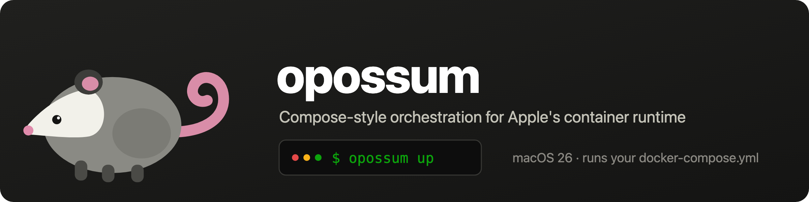

<p align="center">
  
</p>

A Docker Compose–like orchestrator for [Apple's `container`](https://github.com/apple/container)
runtime on macOS. Define a multi-service stack in a familiar `compose.yaml`, and
`opossum` starts each service in dependency order on a shared network so they can
reach each other by name.

opossum is compatible with Docker Compose files (`docker-compose.yml`) and
implements a subset of the open [Compose specification](https://compose-spec.io).

> **Why this works now:** container-to-container networking and name resolution
> rely on features in **macOS 26**. On macOS 15 containers are network-isolated,
> so this kind of orchestration isn't possible. `container` reached 1.0 in
> June 2026.

## Features

- **Dependency-ordered startup** — topologically sorted `depends_on`, torn down in reverse.
- **Health-gated & one-shot dependencies** — `service_healthy` waits on a healthcheck; `service_completed_successfully` runs a one-shot to exit 0 first.
- **Bare-name service discovery** — peers reach each other by service name over a per-project network.
- **Multiple projects at once** — containers are namespaced per project, so stacks with the same service names run side by side (no extra setup).
- **Commands** — `up [service…]` (whole project or a subset), `down`, `ps` (IP/ports/status), `logs [-f] [-n]`, `stop`, `restart`.
- **Compose subset** — `image`, `build`, `ports`, `environment`, `volumes`, `command`, `entrypoint`, `healthcheck`, plus `.env` / `${VAR}` interpolation.
- **Fails clean** — a failed `up` rolls back the containers it started and the network it created.

See the [`CHANGELOG`](CHANGELOG.md) for the full history and [`examples/`](examples/README.md) for a walkthrough.

## Why opossum (vs docker compose)?

opossum gives you a familiar `docker compose`-style workflow, but on Apple's
`container` instead of Docker Desktop. That swaps Docker's one big always-on
Linux VM for **a lightweight VM per container**, which changes the trade-offs.
Measured on one Mac (macOS 26, Apple silicon; container 1.0.0 vs Docker Engine
29.5.3 — [full method & caveats](docs/benchmarks.md)):

| | Docker Desktop | Apple `container` (opossum) |
|---|---|---|
| Memory at idle | ~373 MB host procs **+ ~7.8 GB provisioned always-on Linux VM** (`docker info` MemTotal) | **~58 MB** helpers, **no always-on VM** (memory only while containers run — each is its own VM at ~250–400 MB) |
| Single-container start | **~0.19 s** | ~0.81 s |
| Isolation | shared VM kernel | **per-container VM** |
| License | paid subscription for larger orgs | open source, none |

**The honest summary:** Docker starts an individual container faster (its VM is
already warm), but Apple `container` is *far* lighter at rest — no multi-GB VM
sitting idle — and gives per-container VM isolation with no Docker Desktop
dependency. opossum layers the compose UX (dependency ordering, bare-name
discovery, health gating, multi-project isolation) on top of that. It's the
better fit when you want compose ergonomics without a heavy always-on VM;
Docker still wins when per-start latency across many short-lived containers
dominates. One thing it does **not** fix: bind-mount file I/O is the same
host↔VM shared-filesystem model as Docker (metadata-heavy small-file work is
slow in both) — keep hot paths like DB data and `node_modules` in a **named
volume**. See [`docs/benchmarks.md`](docs/benchmarks.md), and
[`docs/vs-docker-desktop.md`](docs/vs-docker-desktop.md) for a measured,
honest side-by-side (idle footprint, throwaway-container speed, build, disk,
and the daily-op gaps).

**Native networking, not reimplemented.** opossum leans on Apple `container`'s
built-in DNS (macOS 26) instead of building its own: it names each container
`<service>.<project>.<domain>` and gives it the matching search domain — exactly
the way the runtime expects — so services resolve each other by their **bare
service name** and separate projects stay isolated, with no overlay network or
`/etc/hosts` rewriting of opossum's own. Because opossum is a thin layer over
`container` 1.0, it *inherits* the runtime's networking rather than working
around it: the name resolution is the runtime's built-in DNS doing the work, and
opossum just follows its naming convention.

## Design

opossum is a thin orchestration layer — it never re-implements the runtime:

- **Parsing** — reads a subset of the compose schema (`image`, `build`, `ports`,
  `environment`, `volumes`, `depends_on`, `command`, `entrypoint`).
- **Ordering** — topologically sorts services by `depends_on` (cycles are
  rejected) and starts them in that order, tears them down in reverse.
- **Service discovery** — creates a per-project network (`<project>-net`) and
  attaches every service to it. The runtime registers a container in its DNS
  server when the container is **named `<name>.<domain>`**, so opossum names each
  container `<service>.<domain>` (e.g. `db.opossum`) and starts it with
  `--dns-domain <domain>` (default `opossum`). Because every container then has
  `<domain>` in its search list, peers reach each other by the **bare service
  name** (`db`, `cache`, …) — matching compose semantics. The domain must be
  created once (see Setup); this relies on `container`'s built-in DNS on
  macOS 26+.
- **Runtime** — everything is delegated to the `container` CLI
  (`build`, `run`, `stop`, `delete`, `network`, `inspect`).

```
compose.yaml ─▶ compose.Load ─▶ StartupOrder ─▶ orchestrator ─▶ container CLI
```

## Requirements

- macOS 26+ on Apple silicon
- [`container`](https://github.com/apple/container) installed, started
  (`container system start`), and on `PATH`
- Go 1.25+ (to build)

## Install

### Homebrew

```sh
brew install suruseas/opossum/opossum
```

This installs a pre-built binary — no Go toolchain or local build — and pulls in
Apple's `container` runtime as a dependency. (Published with each tagged release;
`darwin/arm64` only, since the runtime requires macOS 26 on Apple silicon.)

### From source

```sh
make build   # builds ./opossum with the version stamped in
# or, without make (a plain `go build` reports a dev version):
go build -ldflags "-X main.version=$(git describe --tags --always | sed 's/^v//')" -o opossum ./cmd/opossum
# then move it onto your PATH, e.g.
mv opossum /usr/local/bin/
```

## Setup (once)

Service discovery needs a local DNS domain registered with the system. Create it
once — this persists across reboots:

```sh
sudo container system dns create opossum
```

Use a different name with `--dns-domain <name>` (and create that name instead).
Remove it later with `sudo container system dns delete opossum`.

## Quickstart (coming from `docker compose`)

opossum reads your existing `compose.yaml` / `docker-compose.yml` **as-is** — no
conversion, no new file. If you're switching from Docker Desktop you almost
certainly already have your images built, so the quickest way in is to reuse
those builds and skip Apple's (cold-starting) builder:

```sh
# One-time: start Apple container and register a local DNS domain so services
# can resolve each other by name
container system start
sudo container system dns create opossum

cd path/to/your-project
docker compose build       # if you haven't already (or the images are already there)
opossum up --from-docker   # import each built image from Docker, then start
```

opossum names a built image `<project>-<service>` just like `docker compose`,
defaulting the project to the directory name — so the import lines up. If your
directory name contains `_` or `.` the two tools normalize it differently; pass
the **same** `-p <name>` to both commands in that case.

That's it — the same project, running on Apple `container`. Work with it using
the verbs you already know:

```sh
opossum ps            # services / IP / ports / status
opossum stats         # live CPU / memory / net / I/O per service
opossum logs web -f   # follow a service's logs
opossum exec -it web sh
opossum down          # stop + remove (add -v to also drop named volumes)
```

**Prefer to build with Apple's builder?** Drop `--from-docker` and run
`opossum up` — opossum builds any `build:` service itself (a heavy build can be
slow; see [Troubleshooting builds](#troubleshooting-builds)). Either way, run
`opossum config` first to preview the resolved configuration and any fields
opossum ignores (`networks`, `restart`, …).

**If a service doesn't come up**, each of these is also warned about at `up` time
(see [Differences from docker compose](#differences-from-docker-compose)):

1. **DNS domain not registered** → services can't resolve each other by name. Run the setup line above.
2. **Postgres data on a named volume** → `initdb` fails. Set `PGDATA` to a subdirectory (`environment: PGDATA=/var/lib/postgresql/data/pgdata`). MySQL/MariaDB are fine.
3. **Host port already in use** → `up` names the port and service; on macOS a taken 5000/7000 is often the **AirPlay Receiver** (turn it off in System Settings › General › AirDrop & Handoff, or remap the host port).
4. **Building from a temp/scratch dir** → Apple's builder can't read a context under `/private/tmp` or a symlink. Build from a real path under your home directory (or use `--from-docker`).

### Reuse images you already built with Docker

Images are OCI-standard, so a Docker-built image runs on Apple `container` — the
two just keep separate stores. If you're coming from `docker compose`, you almost
certainly already have your services built; `opossum import` copies them over so
the first `up` starts everything **without rebuilding** in Apple's builder:

```sh
docker compose build          # (or you already have the images)
opossum import                # docker save → container image load, per build service
opossum up                    # starts immediately; no rebuild

# …or in one step — import each build service instead of building it, then start:
opossum up --from-docker
```

`docker compose` and opossum name a built image the same way
(`<project>-<service>:latest`), so the import lands under the tag `up` looks for.
This is also the escape hatch when Apple's builder can't handle a Dockerfile
(BuildKit-specific features): build it with Docker and import it. `docker` is only
invoked by `import` — the normal path never shells out to it. Alternatively, push
the image to a registry and let `opossum pull` fetch it.

### Safe to try alongside Docker

opossum drives Apple's `container` runtime, which is **entirely separate from
Docker** — separate images, containers, and volumes, in their own storage. So you
can run `opossum up` in a project you already use with `docker compose` without
disturbing it:

- **Your Docker containers and named volumes are not touched.** opossum only ever
  invokes the `container` CLI, never `docker`. It creates its *own* named volumes
  in the `container` runtime, and even `opossum down -v` removes only those — a
  Docker volume of the same name (and its data) is left intact.
- **Bind mounts are the one shared surface.** A `./path:/…` bind mount points both
  engines at the same host directory, so don't run opossum and Docker against the
  same bind-mounted data (e.g. a database dir) *at the same time* — that's the
  usual "two engines, one data directory" hazard, not something opossum does to
  you.
- **Ports and data.** If your Docker stack is already up on the same host ports,
  opossum's `up` simply fails to bind (nothing is harmed). And because named-volume
  data isn't shared between the two runtimes, opossum starts such a service from a
  fresh, empty volume rather than your Docker data.

In short: **point opossum at your existing `docker-compose.yml` and try `opossum
up`** — the worst case is a port clash or an unsupported field it simply skips
(run `opossum config`, or `--verbose`, to see which), not lost data.

## Usage

```sh
opossum up                 # build + start everything (detached)
opossum up web             # start only web and its dependencies
opossum up web --foreground  # run a single service attached in the foreground
opossum ps                 # show service / container / IP / ports / status
opossum logs               # show logs for all services
opossum logs web --follow  # follow one service's logs (-n N to tail)
opossum stats              # live CPU/memory/net/IO per service (--no-stream for one snapshot)
opossum exec web ls -la    # run a command in a running service
opossum exec -it web sh    # interactive shell in a service
opossum run --rm web sh    # one-off throwaway container for a service
opossum stop [service...]  # stop services without removing them
opossum restart [service…] # stop then start services in place
opossum down               # stop + remove services and the network

opossum -f path/to/compose.yaml up      # custom compose file
opossum -p myproj up                     # override the project name
```

With no `-f`, opossum discovers a compose file in the working directory, using
docker-compose's precedence: `compose.yaml`, `compose.yml`,
`docker-compose.yaml`, then `docker-compose.yml` — so an existing
`docker-compose.yml` runs as-is.

Try the bundled examples — a build-free `hello.yaml` and a full-feature
`compose.yaml`. See [`examples/README.md`](examples/README.md) for a walkthrough
of every subcommand:

```sh
cd examples
opossum -f hello.yaml up
opossum -f hello.yaml ps
```

The example's `web` service prints the resolved IPs of `db` and `cache` on
startup, demonstrating name-based discovery.

## Compose support

| Field | Supported | Notes |
|-------|-----------|-------|
| `image` | ✅ | |
| `build` | ✅ | string context or `{context, dockerfile, args, target}` (multi-stage `target`) |
| `platform` | ✅ | passed to `container run --platform`; `linux/amd64` also enables `--rosetta` so x86-64-only images run on Apple silicon |
| `ports` | ✅ | passed to `container run -p` |
| `environment` | ✅ | list or map form; null value passes host value through |
| `env_file` | ✅ | string or list (short, or long `{path, required}`); `KEY=VALUE` files folded in, `environment` overrides them. Missing file errors unless `required: false` |
| `volumes` | ✅ | bind mounts (host paths resolved against the compose dir; `~` expanded; a missing source directory is created), named volumes (namespaced `<project>_<volume>`), and `type: tmpfs` (mounted via `--tmpfs`); short `src:dst[:ro]` or long form (`{type, source, target, read_only}`) |
| `tmpfs` | ✅ | service-level tmpfs targets (string or list); folded together with any `type: tmpfs` volume entries |
| `secrets` | ✅ | file-based only; mounted read-only at `/run/secrets/<name>` (the `*_FILE` pattern). `external` secrets are rejected; `uid`/`gid`/`mode` are not applied |
| `depends_on` | ✅ | list or long (`condition`) form — orders startup and gates on `service_healthy` / `service_completed_successfully` |
| `healthcheck` | ✅ | `test` (CMD / CMD-SHELL / string), `interval`, `timeout`, `retries`, `start_period` |
| `command` | ✅ | list, or a string that is shell-word-split (`sh -c "echo hi"` → `sh`, `-c`, `echo hi`) |
| `entrypoint` | ✅ | overrides the image ENTRYPOINT; string (shell-split) or list, same as `command` |
| `profiles` | ✅ | a gated service starts only when one of its profiles is active (`--profile <name>`, `COMPOSE_PROFILES`, or naming the service); services with no `profiles` always start |
| `mem_limit` / `cpus` | ✅ | passed to `container run` as `-m` / `-c`. Also reads `deploy.resources.limits.{memory,cpus}` (the two forms must agree); memory is rounded up to MiB, CPUs to a whole number (Apple's runtime allocates whole vCPUs) |
| `ssh` | ✅ | `ssh: true` forwards the host's SSH agent into the container (`container run --ssh`), so a service can `git clone`/`push` private repos over SSH using your host keys — without baking keys into the image. Also available per one-off as `opossum run --ssh`. (An opossum extension; docker compose only has build-time `build.ssh`.) |
| `${VAR}` interpolation | ✅ | `$VAR`, `${VAR}`, `${VAR:-default}`, `${VAR:?required}`, `$$` escape; values from a `.env` file next to the compose file (or `--env-file` paths, which replace `.env`; later files win), overridden by the shell |

Other compose fields (e.g. `container_name`, `restart`, `networks`)
are parsed but not acted on — `opossum config` (or `opossum up --verbose`) lists
the ignored fields, so a `docker-compose.yml` runs without surprises.

**Multiple files merge** like docker compose: pass `-f base.yml -f override.yml`
(later files override earlier ones — mappings merge by key, most sequences append,
`command`/`entrypoint` replace), and a `compose.override.yaml` (or
`docker-compose.override.yml`) next to a discovered compose file is merged
automatically.

## Command support

opossum mirrors the common `docker compose` subcommands, delegating each to the
`container` CLI.

| Command | Supported | Notes |
|---------|-----------|-------|
| `up [service…]` | ✅ | build + start the project, or named services plus their deps. Leaves a running service untouched when its config is unchanged (build images only if missing), and flags orphan containers from removed services; `--force-recreate`, `--build`, `--no-build`, `--from-docker` (import build images from Docker instead of building), `--remove-orphans`, `--foreground`, `--profile` |
| `down [-v] [--rmi local\|all]` | ✅ | stop, remove, and delete the project network; `-v` also removes named volumes; `--rmi local` removes opossum-built images (`all` also removes pulled ones); `--remove-orphans` also removes containers for services no longer in the compose |
| `ps` | ✅ | service / container / IP / ports / status |
| `images` | ✅ | each service's image, whether opossum builds it, and whether it's present locally |
| `logs [service…]` | ✅ | `--follow` (several services multiplexed, each line prefixed with its name), `-n/--tail` |
| `stats [service…]` | ✅ | live CPU / memory / net / block I/O / pids (streams; `--no-stream` for a snapshot) |
| `exec [-it] <service> <cmd…>` | ✅ | run a command in a running service |
| `build [service…]` | ✅ | build images for services with `build:` |
| `pull [service…]` | ✅ | pull images for services with `image:` |
| `import [service…]` | ✅ (extra) | copy a service's Docker-built image into `container`'s store, so `up` skips the rebuild |
| `doctor` | ✅ (extra) | diagnose the environment (runtime, DNS domain, outbound network, build VM memory, stack memory estimate); prints ✅/⚠️/❌ + a one-line fix each |
| `cp <src> <dst>` | ✅ | copy files between a service's container and the host (each path is a host path or `service:path`), like `docker compose cp` |
| `start [service…]` | ✅ | start existing (stopped) containers |
| `stop [service…]` | ✅ | stop without removing |
| `restart [service…]` | ✅ | stop then start in place |
| `kill [service…]` | ✅ | send a signal (default KILL); `-s/--signal` |
| `run [--rm] [--no-deps] [-T] <service> [cmd]` | ✅ | one-off foreground container; starts deps unless `--no-deps`; `-T`/`--no-tty` disables the pseudo-terminal; progress goes to stderr so the one-off's stdout stays clean (usable as an MCP stdio bridge); no published ports |
| `config [--services]` | ✅ | validate and print the resolved config (interpolation + env_file applied), noting ignored fields; mirrors what `up` starts, so `profiles:`-gated services appear only with `--profile` |

Add `--verbose` to any command to print each underlying `container` invocation
(as `+ container …`) to stderr — handy when filing a bug report, so you can see
exactly what opossum ran.

## Differences from docker compose

opossum aims to run a familiar `compose.yaml`, but it delegates to Apple's
`container` (not the Docker engine), so some behaviors differ and some compose
features aren't supported. The detailed rationale for each is in
[Known limitations](#known-limitations); this is the scannable overview.

**Behaves differently** (same field, different mechanics):

| Area | docker compose | opossum (on Apple `container`) |
|------|----------------|--------------------------------|
| Setup | none | one-time `sudo container system dns create opossum` for name resolution |
| Container names | `<project>-<service>-N` | `<service>.<project>.<domain>` (DNS-registered for bare-name discovery) |
| Named volumes | shared globally by name | namespaced `<project>_<volume>`; `down -v` only removes this project's |
| Volume seeding | a fresh named/anonymous volume is pre-filled from the image's contents at that path | **not seeded** — a fresh volume always mounts empty (named *and* anonymous) |
| Networks | user-defined networks/aliases | one network per project (`<project>-net`); `networks:` is ignored |
| Published ports | a bare `ports: - "3000"` picks a random host port | mirrors it to `3000:3000` — Apple `container` requires a host port and has no random option |
| Healthcheck | engine-native | no native support — opossum runs `healthcheck.test` via `container exec` and polls |
| `service_completed_successfully` | engine tracks exit | opossum runs the one-shot in the **foreground** (an exit code is only observable there) |

**Not supported / hard constraints:**

- **Platform**: macOS 26+ on Apple silicon, single host only (no Swarm/remote). Relies on `container`'s macOS-26 networking + DNS.
- **Ignored fields** (parsed and listed by `opossum config` / `--verbose`, not acted on): `networks`, `restart`, `deploy` (except `resources.limits`), `container_name`, `cap_add`/`cap_drop`, `sysctls`, `devices`, `privileged`, and top-level volume `driver`/`labels`.
- **`secrets`**: file-based only; `external` secrets and `uid`/`gid`/`mode` are not applied.
- **DB data dirs**: Postgres `initdb` fails on a named-volume mount point — use a **subdirectory** (`PGDATA=/var/lib/postgresql/data/pgdata`). Very common in real app composes (gitea, nextcloud, …), so `up` **warns** when it sees a named volume at `/var/lib/postgresql/data` without a PGDATA subdirectory. (MySQL/MariaDB tolerate the mount point.)
- **Volumes aren't seeded from the image**: Docker copies an image's directory contents into a *fresh* named or anonymous volume the first time it's used; Apple `container` mounts it **empty**. This breaks the common dev pattern of a bind-mounted source plus a `- /app/node_modules` volume to preserve the image's installed dependencies — on opossum that `node_modules` is empty and the app fails to start (`ng serve`/`vite`/etc. can't find their packages). Work around it by installing deps at container start (`command: sh -c "npm ci && npm start"`), or by not shadowing the dependency dir with a volume. Applies to **named volumes too**, not just anonymous ones.
- **Build context**: Apple's builder can't read a context under `/private/tmp` or a symlinked directory — build from a real path under your home dir (`up` warns).
- **Won't run at all**: composes that need Linux-host kernel access (WireGuard's `NET_ADMIN` + `/lib/modules`) — Apple `container` doesn't provide it (also true of Docker Desktop for the host-path cases). Tools that drive Docker through `/var/run/docker.sock` (e.g. Portainer) also can't manage opossum's containers: bind-mounting a host Unix socket into a container *does* work now (since `container` 1.1.0), but Apple `container` exposes no Docker-compatible daemon socket — it talks to the host over XPC — so the mount has nothing on the other end.
- **cgroup-sensitive JVM images (e.g. Elasticsearch 7.x)**: the container's bundled JDK reads the host cgroup to size the heap, and Apple `container`'s VM doesn't expose the cgroup mount the way it expects — the process crashes at launch with `CgroupInfo.getMountPoint() … null` before any config applies (`ES_JAVA_OPTS`/`JAVA_TOOL_OPTIONS` don't help; observed on Elasticsearch 7.16 and 7.17). `opossum ps` shows such a service as `stopped`; check `opossum logs <svc>`. This is a runtime/JDK–VM incompatibility, not an opossum limitation.
- **Not parsed**: `configs`, `extends`, and the map form of `external`.

Everything else in the [Compose support](#compose-support) and
[Command support](#command-support) tables works as in docker compose.

## Running multiple projects at once

Projects are isolated automatically — no extra setup beyond the single `opossum`
domain. opossum namespaces each container by project: it names them
`<service>.<project>.<domain>` and puts `<project>.<domain>` in the DNS search
list, so a peer still resolves a bare service name, but to *its own* project's
copy (in project `demo`, `db` → `db.demo.opossum`). Each project also gets its
own network (`<project>-net`) and its own named volumes (`<project>_<volume>`).
So two projects can share service names and run concurrently, fully isolated:

```sh
opossum -p shopapi up      # db → db.shopapi.opossum
opossum -p blog   up       # its own db → db.blog.opossum, no collision
```

Bare-name resolution still relies on the one registered domain (see *Setup*);
`container` exposes no network aliases, so the `<project>` subdomain is what
keeps names from colliding. As a backstop for the no-DNS-domain case
(`--dns-domain ""`, where containers take bare names), every container is labeled
`opossum.project=<name>` and opossum **refuses to start** (rather than silently
replacing) a container another project already owns.

## Known limitations

- **Named volumes are mount points, so a database's data directory can't sit
  directly on one.** opossum passes named volumes through and the runtime
  auto-creates them, but `container` mounts a volume as a filesystem mount point
  containing `lost+found`. Postgres/MySQL `initdb` refuses a non-empty data
  directory, so `-v pgdata:/var/lib/postgresql/data` fails. Point the database at
  a **subdirectory** of the mount instead — e.g. for Postgres set
  `environment: { PGDATA: /var/lib/postgresql/data/pgdata }`. Only bind-mount host
  paths are resolved to absolute paths. Named volumes are namespaced per project
  (`<project>_<volume>`), so concurrent projects don't share one — except a
  volume declared `external: true` in the top-level `volumes:` block, which is
  used by its real name (its declared `name:`, or the key) and never removed by
  `down -v` — the user manages it. `external` takes the bool form; the volume
  must already exist (opossum doesn't create it). Other top-level volume settings
  (`driver`, `labels`, …) are not applied.
- **A named volume can't be shared by two running containers.** `container`
  attaches a named volume as an exclusive block device, so if two services mount
  the same named volume, the first to start gets it and the others fail with `The
  storage device attachment is invalid`. (Docker shares named volumes; a common
  case is an app + nginx sharing a `public`/assets volume.) `up` **warns** when it
  sees this — use a **bind mount** (a host path, which *is* shareable) for the
  shared data, or bake it into the image.
- **`networks:` is ignored** — every service joins the single per-project network
  (`<project>-net`), so they can all reach each other. Custom networks, aliases,
  or frontend/backend isolation are not applied (`up` warns).
- **`restart:` policies are ignored** — opossum does not restart a container that
  exits (`up` warns). Also, `restart` (the command) reassigns a container's IP;
  its name and config are preserved, so name-based discovery is unaffected.
- **No Docker-in-Docker / nested containers inside a service.** A service runs in
  a `container run` VM with no nested virtualization (no `/dev/kvm`), so it can't
  run its own containers — a build/test job that shells out to `docker` won't
  work inside a service. Apple `container` *can* do nested virtualization, but
  only through a separate `container machine --virtualization` VM, which needs
  Apple silicon **M3 or newer** (with macOS 15+). opossum doesn't yet drive
  container machines, so there's no supported nested-container path today. This is
  a natural area to extend — **contributions welcome** (see the tracking issue for
  agent/sandbox use cases).

### Health-gated startup

`depends_on: {<svc>: {condition: service_healthy}}` makes opossum wait until the
dependency is healthy before starting the dependent. Apple's `container` runtime
has no native healthcheck, so opossum runs the dependency's `healthcheck.test`
via `container exec` and polls it (`retries` attempts, `interval` apart, after an
initial `start_period`) until it passes. The dependency must define a
`healthcheck`, or the file is rejected. The default condition (`service_started`)
still just orders startup.

`depends_on: {<svc>: {condition: service_completed_successfully}}` treats the
dependency as a one-shot (e.g. a migration/init step): opossum runs it in the
**foreground** and only starts the dependent if it exits 0. The runtime exposes
an exit code only from a foreground `run` — `container inspect` reports a bare
`stopped` with no code — so a run-to-completion service can't also be required
`service_healthy` (it stops when it finishes); that combination is rejected.

### Variable interpolation

References in the compose file are expanded before parsing. Values come from a
`.env` file sitting next to the compose file (`KEY=value` lines, `#` comments,
optional surrounding quotes), and the process environment overrides them — so
`FOO=bar opossum up` wins over `FOO` in `.env`. Supported forms: `$VAR`,
`${VAR}`, `${VAR:-default}` (default when unset **or empty**), `${VAR-default}`
(default only when unset), `${VAR:?message}` / `${VAR?message}` (fail if
unset/empty), and `$$` for a literal `$`. An undefined variable with no default
expands to an empty string.

opossum also provides one built-in: **`${OPOSSUM_HOST_GATEWAY}`** — the address a
container can use to reach a service running on the host (see below). A shell env
var or `.env` entry of the same name overrides it.

### Reaching a service on the host

A common local-AI setup keeps the heavy piece — say an LLM server like Ollama or
an MLX endpoint — running **natively on the host** (fastest access to the GPU),
with the rest of the stack (app, vector DB, workers) in containers. The
containers then need to call back to that host service.

Apple `container`'s default network is NAT-only: there's no `host.docker.internal`
name and no `--add-host`. But a container **can** reach the host at the host's own
LAN address, so opossum exposes that as the built-in `${OPOSSUM_HOST_GATEWAY}`:

```yaml
services:
  app:
    image: my-rag-app
    environment:
      # resolves to the host's LAN IP at load time, e.g. http://192.168.11.22:11434
      OLLAMA_HOST: http://${OPOSSUM_HOST_GATEWAY}:11434
  qdrant:
    image: qdrant/qdrant:latest
    ports:
      - "6333:6333"
```

Two requirements for the host service to be reachable:

- **Bind on `0.0.0.0`, not `127.0.0.1`.** A loopback-only bind is invisible to
  the container. For Ollama, `OLLAMA_HOST=0.0.0.0 ollama serve`.
- **The host needs a LAN address.** The value is the host's current outbound IP,
  so it changes with the network and is empty when the host is offline. Guard
  with a default if you need one: `${OPOSSUM_HOST_GATEWAY:-127.0.0.1}`. Run
  `opossum config` to see the value that will be used.

See [`examples/local-ai-stack`](examples/local-ai-stack) for a full stack.

## Troubleshooting builds

Builds run in Apple's shared `container` builder VM, which starts with modest
resources (2 CPUs / 2 GB). Since each running service is its own VM too, a heavy
build can starve.

- **A build is very slow, runs out of memory, or fails with `Unavailable` /
  `EOF`** (e.g. a large multi-stage image, or a big `apt-get install`): give the
  builder more resources. It's a shared VM, so this is a one-time setup, not
  per-project.
  ```sh
  container builder delete --force
  container builder start --cpus 4 --memory 8g
  opossum up
  ```
  Also make sure the host has RAM to spare — stopping other heavy services while
  the first build runs helps, since every service is a separate VM.
- **A build hangs or fails with `unable to read root manifest` /
  `failed to load cache key`** (often after interrupting a build with Ctrl-C):
  the builder cache is in a bad state. Reset it and retry:
  ```sh
  container builder delete --force
  opossum up
  ```
- **`transferring context` is slow**: your build context is large. Add a
  `.dockerignore` next to the Dockerfile that excludes things the image doesn't
  need — `.git`, `node_modules`, `tmp`, `log`, `vendor/bundle`, build artifacts —
  so less data is sent to the builder.

## Development

```sh
go test ./...

# Smoke-test the orchestration without the real runtime using the fake shim:
OPOSSUM_CONTAINER_BIN="$PWD/testdata/fake-container.sh" \
  go run ./cmd/opossum -f examples/compose.yaml up
```

`OPOSSUM_CONTAINER_BIN` overrides which binary is invoked as the runtime. The
fake shim's output is kept in sync with the real CLI (see
[`testdata/real-cli-output.md`](testdata/real-cli-output.md)).

For the reproducible **real-`container` review** procedure (prerequisites,
steps, and known gotchas), see
[`docs/real-runtime-review.md`](docs/real-runtime-review.md).

## How opossum is developed

opossum is developed primarily by an autonomous AI coding agent, which plans,
implements, tests, reviews, and self-merges its changes; a human sets direction
and approves releases.

## License

opossum is released under the [MIT License](LICENSE).

## Trademarks

opossum is not affiliated with, endorsed by, or sponsored by Docker, Inc. Docker
and the Docker logo are trademarks or registered trademarks of Docker, Inc. in
the United States and/or other countries.
