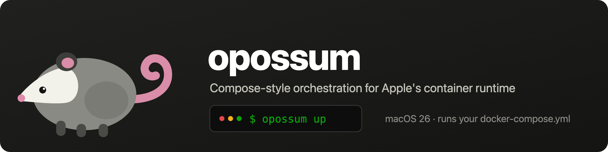

<p align="center">
  
</p>

<p align="right"><a href="README.ja.md">日本語</a></p>

# opossum — run docker compose projects on Apple's container runtime

Apple's `container` starts one container at a time — no compose file, no
dependency order, no name-based service discovery. opossum runs the
`compose.yaml` you already have on it, with no Docker Desktop and no daemon.

It reads Docker Compose files (`docker-compose.yml`) and implements a subset of
the open [Compose specification](https://compose-spec.io): services start in
dependency order on a shared per-project network, so they reach each other by
name. Requires macOS 26 or later and [Apple's
`container`](https://github.com/apple/container).

<!-- compat-figures -->
Measured on 156 real-world compose projects: 61 (39%) ran completely as written,
78 (50%) with `--from-docker-compose`, and 0 were made worse — see [measured
compatibility](docs/compatibility.md) for the method and the breakdown of what is
still in the way.
<!-- /compat-figures -->

> **Using opossum from an AI agent?** Point it at [`AGENTS.md`](AGENTS.md) — a
> high-density, facts-only reference (command surface, the supported/ignored/
> rejected compose fields, and failure-signature→fix table) meant to drop into an
> agent's context window. The human quickstart below still applies.

> **Why this works now:** container-to-container networking and name resolution
> rely on features in **macOS 26**. On macOS 15 containers are network-isolated,
> so this kind of orchestration isn't possible. `container` reached 1.0 in
> June 2026.

## Why this and not the alternatives

Three things, with the measurement behind each.

**1. Real compose files, measured.** 156 self-hosting projects from
[Compose-Examples](https://github.com/Haxxnet/Compose-Examples), run unmodified:
61 (39%) came up completely as written, 78 (50%) with `--from-docker-compose`, and
0 were made worse. Every remaining failure is reported with a diagnostic code and
a suggested fix rather than a raw runtime error.
[Method, corpus and the full breakdown →](docs/compatibility.md)

**2. It fixes the incompatibilities for you.** `opossum up --from-docker-compose`
writes a `compose.opossum.yaml` beside your file with the adjustments Apple
`container` needs — a database data directory that has to be a named volume,
Postgres's `PGDATA` moved into a subdirectory — and starts the project with them
merged. Your compose file is never modified. That is where the 39% → 50% comes
from, and nothing else does it.

**3. Nothing runs when nothing is running.** Docker Desktop keeps one always-on
Linux VM; Apple `container` gives each container its own and keeps none at rest.
Measured on one Mac (macOS 26, Apple silicon; `container` 1.0.0 vs Docker Engine
29.5.3):

| | Docker Desktop | Apple `container` (opossum) |
|---|---|---|
| Memory at idle | ~373 MB host procs **+ ~7.8 GB provisioned always-on Linux VM** | **~58 MB** helpers, **no always-on VM** |
| Single-container start | **~0.19 s** | ~0.81 s |
| Isolation | shared VM kernel | **per-container VM** |
| License | paid subscription for larger orgs | open source, none |

Docker starts an individual container faster — its VM is already warm. opossum is
the lighter thing to leave installed. [Full method and caveats →](docs/benchmarks.md)

## Requirements

- macOS 26+ on Apple silicon
- [`container`](https://github.com/apple/container) installed, started
  (`container system start`), and on `PATH` — verified against `container` 1.2.2
- Go 1.25+ (to build)

## Install

### Homebrew

```sh
brew install suruseas/opossum/opossum
```

This installs a pre-built binary — no Go toolchain or local build — and pulls in
Apple's `container` runtime as a dependency. (Published with each tagged release;
`darwin/arm64` only, since the runtime requires macOS 26 on Apple silicon.)

### From source

```sh
make build   # builds ./opossum with the version stamped in
# or, without make (a plain `go build` reports a dev version):
go build -ldflags "-X main.version=$(git describe --tags --always | sed 's/^v//')" -o opossum ./cmd/opossum
# then move it onto your PATH, e.g.
mv opossum /usr/local/bin/
```

## Setup (once)

Service discovery needs a local DNS domain registered with the system. Create it
once — this persists across reboots:

```sh
sudo container system dns create opossum
```

Use a different name with `--dns-domain <name>` (and create that name instead).
Remove it later with `sudo container system dns delete opossum`.

## Quickstart (coming from `docker compose`)

opossum reads your existing `compose.yaml` / `docker-compose.yml` **as-is** — no
conversion, no new file. If you're switching from Docker Desktop you almost
certainly already have your images built, so the quickest way in is to reuse
those builds and skip Apple's (cold-starting) builder:

```sh
# One-time: start Apple container and register a local DNS domain so services
# can resolve each other by name
container system start
sudo container system dns create opossum

cd path/to/your-project
docker compose build       # if you haven't already (or the images are already there)
opossum up --from-docker-compose   # import each built image from Docker, then start
```

opossum names a built image `<project>-<service>` just like `docker compose`,
defaulting the project to the directory name — so the import lines up. If your
directory name contains `_` or `.` the two tools normalize it differently; pass
the **same** `-p <name>` to both commands in that case.

That's it — the same project, running on Apple `container`. Work with it using
the verbs you already know:

```sh
opossum ps            # services / IP / ports / status
opossum stats         # live CPU / memory / net / I/O per service
opossum logs web -f   # follow a service's logs
opossum exec -it web sh
opossum down          # stop + remove (add -v to also drop named volumes)
```

**Prefer to build with Apple's builder?** Drop `--from-docker-compose` and run
`opossum up` — opossum builds any `build:` service itself (a heavy build can be
slow; see [Troubleshooting builds](docs/troubleshooting.md#troubleshooting-builds)). Either way, run
`opossum config` first to preview the resolved configuration and any fields
opossum ignores (`dns_search`, `container_name`, …).

**If a service doesn't come up**, opossum warns about the usual causes at `up`
time and names the fix — an unregistered DNS domain, Postgres data on a named
volume, a host port already taken (on macOS a busy 5000/7000 is often AirPlay
Receiver), a build context under `/private/tmp`.
[Each one, and what to do →](docs/troubleshooting.md)

### Removing it cleanly

Trying something new should be reversible. Teardown comes in three widths:

```sh
opossum down               # daily: stop + remove containers and the network
opossum destroy            # this project, gone: containers, volumes, images, generated state
opossum destroy --dry-run  # see exactly what that would remove, and remove nothing
```

`destroy` removes everything opossum created for the project — containers
(including orphans), the project network, named volumes, images it built or
pulled, the restart supervisor, the `.opossum/` state directory and the generated
`compose.opossum.yaml`. It asks first, and lists what it will remove; `--force`
skips the question for scripts and agents.

**Your files are never touched** — the compose file, `.env` and your sources are
left exactly as they are. Neither is anything shared: volumes declared
`external: true`, other projects' containers, and two machine-wide things that
`destroy` reports rather than removes, since one needs `sudo` and the other would
slow down every unrelated project:

```sh
sudo container system dns delete opossum                  # the local DNS domain
container builder delete --force && container image prune -a  # build cache + unused images
```

## Usage

```sh
opossum up                 # build + start everything (detached)
opossum up web             # start only web and its dependencies
opossum up web --foreground  # run a single service attached in the foreground
opossum ps                 # show service / container / IP / ports / status
opossum logs               # show logs for all services
opossum logs web --follow  # follow one service's logs (-n N to tail)
opossum stats              # live CPU/memory/net/IO per service (--no-stream for one snapshot)
opossum exec web ls -la    # run a command in a running service
opossum exec -it web sh    # interactive shell in a service
opossum run --rm web sh    # one-off throwaway container for a service
opossum stop [service...]  # stop services without removing them
opossum restart [service…] # stop then start services in place
opossum down               # stop + remove services and the network

opossum -f path/to/compose.yaml up      # custom compose file
opossum -p myproj up                     # override the project name
```

With no `-f`, opossum discovers a compose file in the working directory, using
docker-compose's precedence: `compose.yaml`, `compose.yml`,
`docker-compose.yaml`, then `docker-compose.yml` — so an existing
`docker-compose.yml` runs as-is.

Try the bundled examples — a build-free `hello.yaml` and a full-feature
`compose.yaml`. See [`examples/README.md`](examples/README.md) for a walkthrough
of every subcommand:

```sh
cd examples
opossum -f hello.yaml up
opossum -f hello.yaml ps
```

The example's `web` service prints the resolved IPs of `db` and `cache` on
startup, demonstrating name-based discovery.

## Using it from an AI agent

Point the agent at [`AGENTS.md`](AGENTS.md) and ask it your question. It is a
facts-only reference written for a context window: the command surface, every
compose field opossum acts on / ignores / refuses, and a table mapping failure
signatures to fixes. The detailed compatibility questions — "will this field
work?", "why did this fail?" — are answered better by an agent that has read that
file than by a section of this README.

## Documentation

| | |
|---|---|
| [Compatibility](docs/compatibility.md) | The measurement and its method; every compose field and command; where behaviour differs from `docker compose`; reusing images you built with Docker |
| [Networking model](docs/networking.md) | How services find each other, running several projects at once, reaching a service from the host |
| [Troubleshooting](docs/troubleshooting.md) | Build failures on `container`, and the limits worth knowing before you hit them |
| [Benchmarks](docs/benchmarks.md) | Idle cost, start-up time, and what `stats --host` measures |
| [vs Docker Desktop](docs/vs-docker-desktop.md) | A measured side-by-side: idle footprint, throwaway-container speed, build, disk, and the daily-operation gaps |
| [MCP servers](docs/mcp.md) | Give an agent a tool server in its own VM |
| [Agent sandboxes](docs/agent-sandbox.md) | Run something untrusted with no route out |
| [`AGENTS.md`](AGENTS.md) | The same facts, for an AI agent |
| [`CHANGELOG.md`](CHANGELOG.md) · [`examples/`](examples/README.md) | History, and a walkthrough of every subcommand |

## What it doesn't do

Honestly, and in one place: opossum needs **macOS 26** (container-to-container
networking depends on it — on macOS 15 this kind of orchestration isn't possible).
It implements a subset of the Compose specification, and refuses rather than
guesses when a field would change what your project means — `docker.sock` mounts
have no equivalent and are rejected up front. A named volume can only be attached
to one running container at a time, which is Apple `container`'s constraint, not a
choice. Swarm/`deploy` beyond `resources.limits`, `configs`, and `extends` are
ignored, and `opossum config` tells you which fields in your file were skipped.

[The details, and what to do about each →](docs/troubleshooting.md)

## Development

```sh
go test ./...

# Smoke-test the orchestration without the real runtime using the fake shim:
OPOSSUM_CONTAINER_BIN="$PWD/testdata/fake-container.sh" \
  go run ./cmd/opossum -f examples/compose.yaml up
```

Changes that users would notice are recorded as one file per change under
[`changelog.d/`](changelog.d/README.md) rather than by editing `CHANGELOG.md`;
see [CONTRIBUTING.md](CONTRIBUTING.md).

`OPOSSUM_CONTAINER_BIN` overrides which binary is invoked as the runtime. The
fake shim's output is kept in sync with the real CLI (see
[`testdata/real-cli-output.md`](testdata/real-cli-output.md)).

For the reproducible **real-`container` review** procedure (prerequisites,
steps, and known gotchas), see
[`docs/real-runtime-review.md`](docs/real-runtime-review.md).

## How opossum is developed

opossum is developed primarily by an autonomous AI coding agent, which plans,
implements, tests, reviews, and self-merges its changes; a human sets direction
and approves releases.

## License

opossum is released under the [MIT License](LICENSE).

## Trademarks

opossum is not affiliated with, endorsed by, or sponsored by Docker, Inc. Docker
and the Docker logo are trademarks or registered trademarks of Docker, Inc. in
the United States and/or other countries.
