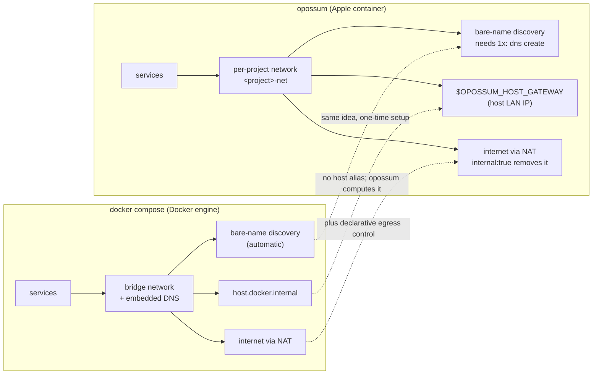

# Networking model

How services find each other, what a project's network is, and the three things
that surprise people coming from `docker compose`.

The place opossum diverges most from docker compose is the network — because Apple
`container`'s network model is genuinely different from the Docker engine's. opossum
maps your compose onto it rather than reimplementing Docker's; this is the map.

At a glance, here is where the two models line up and where opossum has to bridge a gap:



The table below is the same map in detail — each row is one thing you might reach for in docker compose, and what you write instead:

| Concern | docker compose (Docker engine) | opossum (Apple `container`) — what you write |
|---------|--------------------------------|----------------------------------------------|
| Default connectivity | bridge network, outbound via NAT | per-project network, outbound via NAT — nothing to write |
| Reaching the **host** | `host.docker.internal` / `--add-host` | **no `host.docker.internal`** — use the built-in **`${OPOSSUM_HOST_GATEWAY}`** (the host's LAN IP; the host service must bind `0.0.0.0`) — see [Reaching a service on the host](#reaching-a-service-on-the-host) |
| Service **discovery** | automatic embedded DNS on the network | built-in DNS, but it needs a **registered domain** — one-time `sudo container system dns create opossum`; peers then resolve each other by bare service name (`db`, `web`) |
| Container names / **project isolation** | `<project>-<service>-N`, name-scoped | `<service>.<project>.<domain>` on a per-project network (`<project>-net`); projects stay isolated automatically — see [Running multiple projects](#running-multiple-projects-at-once) |
| Restricting **internet egress** | no native control (needs an external firewall) | `internal: true` on a network **removes the route to the internet** (host still reachable); `network_mode: none` = loopback only — see [Constraining egress](agent-sandbox.md) |
| Multiple networks / **external** | supported, with aliases | multiple networks per service (one `--network` each) and `external: true` (reuse a pre-existing network by name) both work |
| Name resolution **on an `internal:` network** | works | **doesn't** — the DNS resolver sits on the gateway an internal network can't route to, so address peers by **IP** (or reach a host proxy via `${OPOSSUM_HOST_GATEWAY}`) |
| Per-network **aliases** / static IPs (`ipam`) | applied | **not applied** (the `<project>` subdomain is what keeps names unique) |

The three surprises for a docker-compose user, and why:

- **There's no `host.docker.internal`.** Apple `container`'s default network is NAT-only and exposes no host alias, so opossum computes the host's LAN address and hands it to you as `${OPOSSUM_HOST_GATEWAY}`, interpolated into your compose at load time. The host service must listen on `0.0.0.0` (not just loopback) to be reachable from the container.
- **Bare-name discovery needs a one-time DNS domain.** The runtime's built-in DNS only serves a *registered* domain, so `sudo container system dns create opossum` (once) is what makes `db`/`web` resolve. Skip it and services can't find each other by name (`opossum doctor` flags this, and startup warns with `[OPSM-202]`).
- **An `internal:` network has no name resolution at all.** Removing the internet route (the point of `internal:`, for agent sandboxes) also removes the route to the DNS resolver — so on an internal network, peers must talk by IP, and the one sanctioned way out is a host proxy at `${OPOSSUM_HOST_GATEWAY}`.

`opossum doctor` checks the two things that most often go wrong here — whether the DNS domain is registered and whether outbound networking works — and prints a one-line fix for each.

## How it works

opossum is a thin orchestration layer — it never re-implements the runtime:

- **Parsing** — reads a subset of the compose schema (`image`, `build`, `ports`,
  `environment`, `volumes`, `depends_on`, `command`, `entrypoint`).
- **Ordering** — topologically sorts services by `depends_on` (cycles are
  rejected) and starts them in that order, tears them down in reverse.
- **Service discovery** — creates a per-project network (`<project>-net`) and
  attaches every service to it. The runtime registers a container in its DNS
  server when the container is **named `<name>.<domain>`**, so opossum names each
  container `<service>.<domain>` (e.g. `db.opossum`) and starts it with
  `--dns-domain <domain>` (default `opossum`). Because every container then has
  `<domain>` in its search list, peers reach each other by the **bare service
  name** (`db`, `cache`, …) — matching compose semantics. The domain must be
  created once (see the README's setup section); this relies on `container`'s built-in DNS on
  macOS 26+.
- **Runtime** — everything is delegated to the `container` CLI
  (`build`, `run`, `stop`, `delete`, `network`, `inspect`).

```
compose.yaml ─▶ compose.Load ─▶ StartupOrder ─▶ orchestrator ─▶ container CLI
```

## Running multiple projects at once

Projects are isolated automatically — no extra setup beyond the single `opossum`
domain. opossum namespaces each container by project: it names them
`<service>.<project>.<domain>` and puts `<project>.<domain>` in the DNS search
list, so a peer still resolves a bare service name, but to *its own* project's
copy (in project `demo`, `db` → `db.demo.opossum`). Each project also gets its
own network (`<project>-net`) and its own named volumes (`<project>_<volume>`).
So two projects can share service names and run concurrently, fully isolated:

```sh
opossum -p shopapi up      # db → db.shopapi.opossum
opossum -p blog   up       # its own db → db.blog.opossum, no collision
```

Bare-name resolution still relies on the one registered domain (see *Setup*);
`container` exposes no network aliases, so the `<project>` subdomain is what
keeps names from colliding. As a backstop for the no-DNS-domain case
(`--dns-domain ""`, where containers take bare names), every container is labeled
`opossum.project=<name>` and opossum **refuses to start** (rather than silently
replacing) a container another project already owns.

## Reaching a service on the host

A common local-AI setup keeps the heavy piece — say an LLM server like Ollama or
an MLX endpoint — running **natively on the host** (fastest access to the GPU),
with the rest of the stack (app, vector DB, workers) in containers. The
containers then need to call back to that host service.

Apple `container`'s default network is NAT-only: there's no `host.docker.internal`
name and no `--add-host`. But a container **can** reach the host at the host's own
LAN address, so opossum exposes that as the built-in `${OPOSSUM_HOST_GATEWAY}`:

```yaml
services:
  app:
    image: my-rag-app
    environment:
      # resolves to the host's LAN IP at load time, e.g. http://192.168.11.22:11434
      OLLAMA_HOST: http://${OPOSSUM_HOST_GATEWAY}:11434
  qdrant:
    image: qdrant/qdrant:latest
    ports:
      - "6333:6333"
```

Two requirements for the host service to be reachable:

- **Bind on `0.0.0.0`, not `127.0.0.1`.** A loopback-only bind is invisible to
  the container. For Ollama, `OLLAMA_HOST=0.0.0.0 ollama serve`.
- **The host needs a LAN address.** The value is the host's current outbound IP,
  so it changes with the network and is empty when the host is offline. Guard
  with a default if you need one: `${OPOSSUM_HOST_GATEWAY:-127.0.0.1}`. Run
  `opossum config` to see the value that will be used.

See [`examples/local-ai-stack`](../examples/local-ai-stack) for a full stack.

[← back to the README](../README.md)
