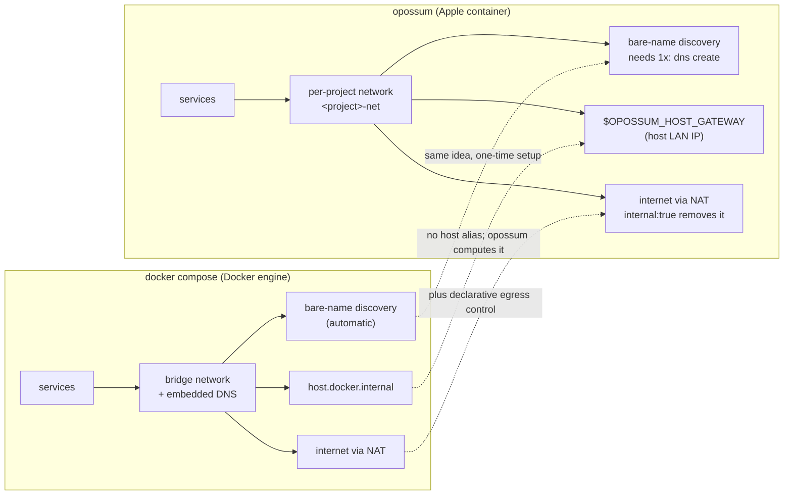

# Networking model

How services find each other, what a project's network is, and the three things
that surprise people coming from `docker compose`.

The place opossum diverges most from docker compose is the network — because Apple
`container`'s network model is genuinely different from the Docker engine's. opossum
maps your compose onto it rather than reimplementing Docker's; this is the map.

At a glance, here is where the two models line up and where opossum has to bridge a gap:



The table below is the same map in detail — each row is one thing you might reach for in docker compose, and what you write instead:

| Concern | docker compose (Docker engine) | opossum (Apple `container`) — what you write |
|---------|--------------------------------|----------------------------------------------|
| Default connectivity | bridge network, outbound via NAT | per-project network, outbound via NAT — nothing to write |
| Reaching the **host** | `host.docker.internal` / `--add-host` | **no `host.docker.internal`** — use the built-in **`${OPOSSUM_HOST_GATEWAY}`** (the host's LAN IP; the host service must bind `0.0.0.0`) — see [Reaching a service on the host](#reaching-a-service-on-the-host) |
| Service **discovery** | automatic embedded DNS on the network | built-in DNS, but it needs a **registered domain** — one-time `sudo container system dns create opossum`; peers then resolve each other by bare service name (`db`, `web`) |
| Container names / **project isolation** | `<project>-<service>-N`, name-scoped | `<service>.<project>.<domain>` on a per-project network (`<project>-net`); projects stay isolated automatically — see [Running multiple projects](#running-multiple-projects-at-once). The name is at most 63 characters on container 1.4.1 (a one-off's is `<service>-run.<project>.<domain>`): `up` and `run` refuse a longer one before creating anything (for `run --audit`, a dependency's is refused after the workspace snapshot), since peers resolve the service by that name |
| Restricting **internet egress** | no native control (needs an external firewall) | `internal: true` on a network **removes the route to the internet** (host still reachable); `network_mode: none` = loopback only — see [Constraining egress](agent-sandbox.md) |
| Multiple networks / **external** | supported, with aliases | multiple networks per service (one `--network` each) and `external: true` (reuse a pre-existing network by name) both work; a declared network is `<project>-<key>` with the key folded to the lower-case name container 1.4.1 takes (`backEnd` → `<project>-backend`), and a network name longer than 63 characters is refused before any container or network is created |
| Name resolution **on an `internal:` network** | works | **only through another network** — a container's resolver is the gateway of the network it is attached to **first**, and an internal network's gateway serves no DNS (queries are refused, though the gateway itself is reachable), so a container whose first network is internal resolves nothing; one that joins an internal network after a normal one resolves through that one. Otherwise address peers by **IP** (or reach a host proxy via `${OPOSSUM_HOST_GATEWAY}`) |
| Per-network **aliases** / static IPs (`ipv4_address`) | applied | **not applied** — `container run` has no flag for either (the `<project>` subdomain is what keeps names unique) |
| A network's **subnet** (`ipam.config[].subnet`) | applied | applied — `container network create --subnet` / `--subnet-v6`, one of each at most; two projects declaring the same subnet are refused by the runtime, as by docker |

The three surprises for a docker-compose user, and why:

- **There's no `host.docker.internal`.** Apple `container`'s default network is NAT-only and exposes no host alias, so opossum computes the host's LAN address and hands it to you as `${OPOSSUM_HOST_GATEWAY}`, interpolated into your compose at load time. The host service must listen on `0.0.0.0` (not just loopback) to be reachable from the container.
- **Bare-name discovery needs a one-time DNS domain.** The runtime's built-in DNS only serves a *registered* domain, so `sudo container system dns create opossum` (once) is what makes `db`/`web` resolve. Skip it and services can't find each other by name (`opossum doctor` flags this, and startup warns with `[OPSM-202]`).
- **An `internal:` network's gateway answers no name.** A container's resolver is the gateway of the network it is attached to **first**, and an internal network's gateway serves no DNS: queries to it are refused, even though the gateway (and the host) still answer pings. So a container whose first network is internal resolves nothing at all, while one that joins an internal network after a normal one still resolves names through the first network's gateway (measured 2026-09-21). Peers that cannot resolve must talk by IP, and the one sanctioned way out is a host proxy at `${OPOSSUM_HOST_GATEWAY}`.

`opossum doctor` checks the two things that most often go wrong here — whether the DNS domain is registered and whether outbound networking works — and prints a one-line fix for each.

## How it works

opossum is a thin orchestration layer — it never re-implements the runtime:

- **Parsing** — reads a subset of the compose schema (`image`, `build`, `ports`,
  `environment`, `volumes`, `depends_on`, `command`, `entrypoint`).
- **Ordering** — topologically sorts services by `depends_on` (a cycle among
  the services a command reads is rejected; one among services behind a
  profile that is not active is not read) and starts them in that order, tears
  them down in reverse.
- **Service discovery** — creates a per-project network (`<project>-net`) and
  attaches every service to it. The runtime registers a container in its DNS
  server when the container is **named `<name>.<domain>`**, so opossum names each
  container `<service>.<project>.<domain>` (e.g. `db.shop.opossum`) and starts it with
  `--dns-domain <domain>` (default `opossum`). Because every container then has
  `<domain>` in its search list, peers reach each other by the **bare service
  name** (`db`, `cache`, …) — matching compose semantics. The domain must be
  created once (see the README's setup section); this relies on `container`'s built-in DNS on
  macOS 26+.
- **A service on several networks** — the runtime registers a container's
  **first** attachment in its DNS, so such a service answers by name with its
  address on the network it is attached to first (the first a list in one file
  writes; name order for a mapping, or for networks merged from several
  files). A peer that shares only a later network gets that address back and
  cannot reach it, while the address on the network they share does answer.
  `up` says which pairs are in that position (`[OPSM-211]`) among the services
  it starts, and a `run` says it for the dependencies it starts and for
  the one-off itself; attach the shared network first, or have the peer use
  the address. Where the one-off is the side that answers, the message gives
  the name its container carries (`<service>-run`) and says what it is, since
  that is the name a peer looks up; where it is the side that asks, it is
  called the one-off this run starts for that service and not named, since
  the name to type from there is the other one. The
  shared network the message names is one that is not `internal: true`, and
  the peer it names is one whose own first network is not internal — a
  container's resolver is that network's gateway, and an internal one answers
  nothing, so such a peer resolves no name at all and reordering the other
  service's networks would not help. The service that answers may have an
  internal network first: it is in DNS all the same, answering with the address
  it has there, which is why reordering its networks is what the message
  advises (measured 2026-09-23). Those pairs are left to `[OPSM-203]`, and so is
  a pair all of whose shared networks are internal. Docker compose
  answers with an address the asking service can reach.
- **Runtime** — everything is delegated to the `container` CLI
  (`build`, `run`, `stop`, `delete`, `network`, `inspect`).

```
compose.yaml ─▶ compose.Load ─▶ StartupOrder ─▶ orchestrator ─▶ container CLI
```

## Running multiple projects at once

Projects are isolated automatically — no extra setup beyond the single `opossum`
domain. opossum namespaces each container by project: it names them
`<service>.<project>.<domain>` and puts `<project>.<domain>` in the DNS search
list, so a peer still resolves a bare service name, but to *its own* project's
copy (in project `demo`, `db` → `db.demo.opossum`). Each project also gets its
own network (`<project>-net`) and its own named volumes (`<project>_<volume>`,
unless a declaration gives the volume a `name:` of its own).
So two projects can share service names and run concurrently, fully isolated:

```sh
opossum -p shopapi up      # db → db.shopapi.opossum
opossum -p blog   up       # its own db → db.blog.opossum, no collision
```

Bare-name resolution still relies on the one registered domain (see *Setup*);
`container` exposes no network aliases, so the `<project>` subdomain is what
keeps names from colliding. As a backstop for the no-DNS-domain case
(`--dns-domain ""`, where containers take bare names), every container is labeled
`opossum.project=<name>` and opossum **refuses to start** (rather than silently
replacing) a container another project already owns. `down` leaves such a
container alone and says so, and `run` refuses a one-off name another project
holds. `start`, `stop`, `kill` and `restart` leave such a container, say so, and
act on the rest of the project; `exec` and `cp` refuse it; `ps` gives it no row
and says so on stderr (docker compose's gives it no row, silently); `port`
reports no container of this project's (docker compose's says the service is
not running); and `logs` and `stats` leave it out and say so (docker compose's
show nothing for it). A container of the name that carries no `opossum.project` label
at all was made outside opossum (`container run --name db …`, say) and is
treated the same way — every service container and one-off opossum makes
carries the label — so `up` refuses it, as docker compose refuses a container
of the name without its labels (`Conflict. The container name … is already in
use`), and `down` leaves it and says so (docker compose leaves it silently). A
container the runtime gives no readable answer about is treated the same way
by every one of these: `up`, `run`, `exec` and `cp` refuse it; `down`, `start`,
`stop`, `kill`, `restart`, `ps`, `logs` and `stats` leave it, name it, act on
the rest, and exit non-zero; `port` reports no container of this project's.
When every container `logs` or `stats` was asked for is someone else's, they
print nothing and exit zero, as docker compose's do.

## Reaching a service on the host

A common local-AI setup keeps the heavy piece — say an LLM server like Ollama or
an MLX endpoint — running **natively on the host** (fastest access to the GPU),
with the rest of the stack (app, vector DB, workers) in containers. The
containers then need to call back to that host service.

Apple `container`'s default network is NAT-only: there's no `host.docker.internal`
name and no `--add-host`. But a container **can** reach the host at the host's own
LAN address, so opossum exposes that as the built-in `${OPOSSUM_HOST_GATEWAY}`:

```yaml
services:
  app:
    image: my-rag-app
    environment:
      # resolves to the host's LAN IP at load time, e.g. http://192.168.11.22:11434
      OLLAMA_HOST: http://${OPOSSUM_HOST_GATEWAY}:11434
  qdrant:
    image: qdrant/qdrant:latest
    ports:
      - "6333:6333"
```

Two requirements for the host service to be reachable:

- **Bind on `0.0.0.0`, not `127.0.0.1`.** A loopback-only bind is invisible to
  the container. For Ollama, `OLLAMA_HOST=0.0.0.0 ollama serve`.
- **The host needs a LAN address.** The value is the host's current outbound IP,
  so it changes with the network and is empty when the host is offline. Guard
  with a default if you need one: `${OPOSSUM_HOST_GATEWAY:-127.0.0.1}`. Run
  `opossum config` to see the value that will be used.

See [`examples/local-ai-stack`](../examples/local-ai-stack) for a full stack.

[← back to the README](../README.md)
